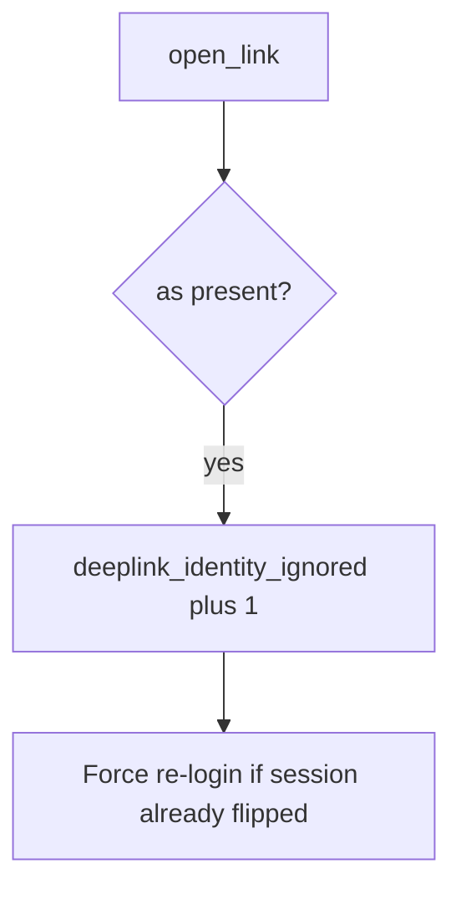

# Log the dropped link, not the URL

**Kind:** operations-exercise
**Loop step:** 6 Operate

## Stopping it is not enough

A new exported Activity can copy extras again after `open_link` was “fixed once.” Pair notice and recover. Do not log full URLs if they contain tokens (4.3). Do not attach the link to the ticket.

## Picture: dropped as= is a signal



Industry lists talk about noticing, responding, and recovering. They do not copy “ignore identity keys.” They do not prove a checklist. Someone still has to own the leftover.

## Signals that do not become a second leak

| Outcome | This topic |
|---|---|
| Notice | `deeplink_identity_ignored` |
| What the line holds | request id, key *name*; never the full URL or token |
| Recover | Keep alice; force re-login if switched |
| Leftover | WebView; custom scheme; attacker app installed |

Naming a mobile-filter product is not the rule. Re-run `test_deeplink_as_param_does_not_switch_user` after any exported-component change; a green “App Links verified” tile is not that check. OAuth redirects (4.5) and WebView bridges are other IPC paths of the same extras — list them before you claim Recover.

## What the framework does vs what you still have to check

Play Console App Link status will show verified hosts and stay silent when an exported Activity still copies `as`. Notice must observe **alice unchanged**, not host association. If the alert includes a full deep-link URL or an OAuth code, you have opened a logging leak (4.3).

What this practice is supposed to show: dropped `as=` fires without the URL. Naming a product is not the rule.

## Practice

Write one log line you would accept in review. Tie it to `labs/8.3/8.3-lab`. Example shape (fake ids only):

```text
log_denied reason=deeplink_identity_ignored field=as request_id=req_83e
```

Reject any line that includes a full deep-link URL, an OAuth code, or a live Intent dump.

## Use it somewhere new

A clinic example: notice `as=doctor` probes on local practice files; do not attach the link to the ticket. Do not send Intents at a live EHR.

## Can people still use it

Deep-link errors must not trap people in a broken WebView with no keyboard-accessible way out (WCAG 2.2).

## What this page is not doing

Naming a mobile-filter product is not the rule. Live Intent dumps are out of scope. Opening this page does not finish a check-in.
