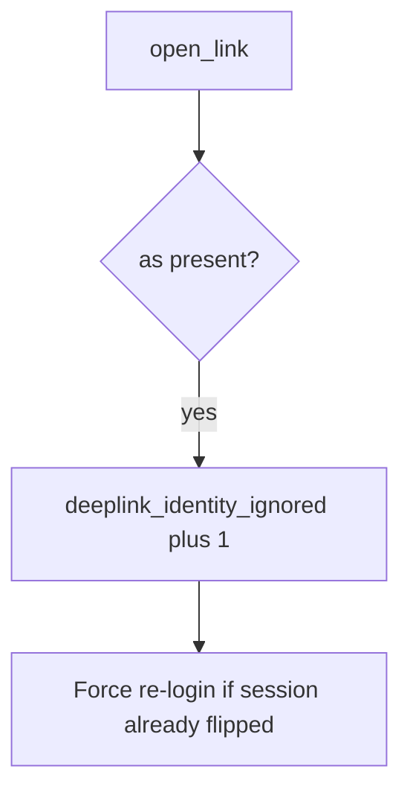

# Log the dropped link, not the URL

**Kind:** operations-exercise
**Loop step:** 6 Operate

## Fixing it once is not enough

An exported Activity can copy extras again and ignore `as=`. Do not paste token-bearing URLs or the dropped link.

## Picture: dropped as= is a signal



An App Links checklist does not drop `as=` from extras.

## Signals that do not become a second leak

| Outcome | This topic |
|---|---|
| Notice | `deeplink_identity_ignored` |
| What the line holds | request id, key *name*; never the full URL or token |
| Recover | Keep alice; force re-login if switched |
| Leftover | WebView; custom scheme; attacker app installed |

A mobile-filter product name does not ignore `as=`. `as=` on the link still has to fail `test_deeplink_as_param_does_not_switch_user`. “App Links verified” does not ignore extras. OAuth redirects (4.5) and WebView bridges are other IPC paths; the deep link is not honest until those extras are named.

## What the framework does vs what you still have to check

Play Console App Link status will show verified hosts and stay silent when an exported Activity still copies `as`. Notice must observe **alice unchanged**, not host association. If the alert includes a full deep-link URL or an OAuth code, you have opened a logging leak (4.3).

Dropped `as=` fires without the URL.

## Practice

```text
log_denied reason=deeplink_identity_ignored field=as request_id=req_83e
```

If the line includes a full deep-link URL, an OAuth code, or a live Intent dump, do not write it.

## Use it somewhere new

Notice `as=doctor` probes on local practice files; do not attach the link to the ticket. Do not send Intents at a live EHR.

## Can people still use it

Deep-link errors must not trap people in a broken WebView with no keyboard-accessible way out (WCAG 2.2).

## What this page is not doing

An App Links screenshot does not finish this page. Do not use live Intent dumps. Opening this page does not finish a check-in.
