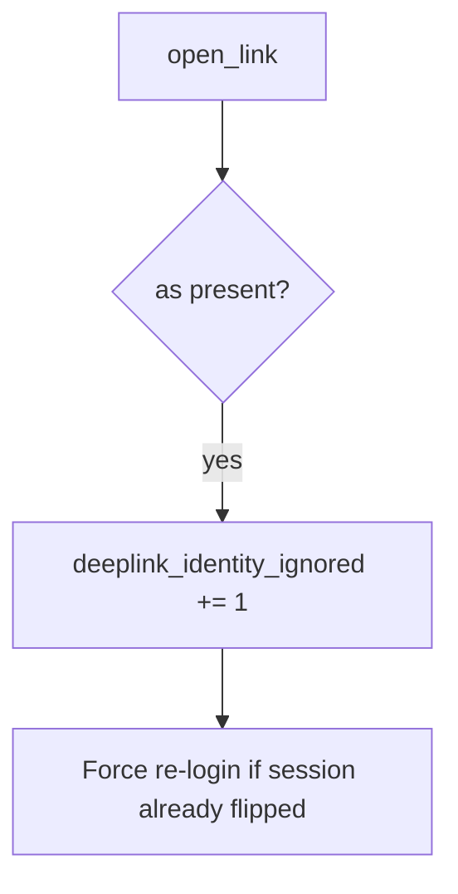

# 8.3-LO-06 — Detect deeplink_identity_ignored without logging the URL

**Kind:** operations-exercise
**Loop step:** 6 Operate
**Standards:** NIST CSF 2.0 (final) DE/RS/RC as outcome labels; MASVS 2.1.0 `MASVS-PLATFORM-1`.

## Prevention is not absolute

A new exported Activity can copy extras again. Pair detect and recover. Do not log full URLs if they contain tokens (4.3).

## Mental model: dropped as= is a signal



| Outcome | This module |
|---|---|
| Detect | `deeplink_identity_ignored` |
| Signal | request id, key *name*; never the full URL or token |
| Recover | Keep alice; force re-login if switched |
| Residual | WebView; custom scheme; attacker app installed |

## Practice

Write one log line you would accept. Tie it to `labs/8.3/8.3-lab`.

```
log_denied reason=deeplink_identity_ignored field=as request_id=req_83e
```

Reject any line that includes a full deep-link URL, an OAuth code, or a live Intent dump.

## Transfer

Clinic: detect `as=doctor` probes; do not attach the link to the ticket.

## Non-goals

A mobile-WAF product name is not the property.
