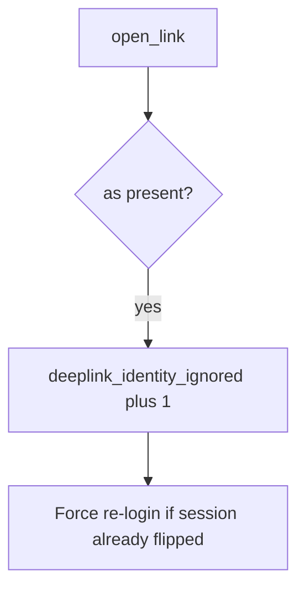

# 8.3-LO-06 — Detect deeplink_identity_ignored without logging the URL

**Kind:** operations-exercise
**Loop step:** 6 Operate
**Standards:** NIST CSF 2.0 (final) DE/RS/RC as outcome labels; MASVS 2.1.0 (final) `MASVS-PLATFORM-1`. Do not use MASVS L1/L2/R.

## Prevention is not absolute

A new exported Activity can copy extras again after `open_link` was “fixed once.” Pair detect and recover. Do not log full URLs if they contain tokens (4.3). Do not attach the link to the ticket.

## Mental model: dropped as= is a signal



| Outcome | This module |
|---|---|
| Detect | `deeplink_identity_ignored` |
| Signal | request id, key *name*; never the full URL or token |
| Recover | Keep alice; force re-login if switched |
| Residual | WebView; custom scheme; attacker app installed |

CSF 2.0 Detect / Respond / Recover name outcomes. They do not prove PLATFORM-1. A mobile-WAF product name is not the property. Re-run `test_deeplink_as_param_does_not_switch_user` after any exported-component change; a green “App Links verified” tile is not that pytest. OAuth redirects (4.5) and WebView bridges are other IPC paths of the same extras — inventory them before claiming Recover.

## Framework defaults versus the operate guarantee

Play Console App Link status will show verified hosts and stay silent when an exported Activity still copies `as`. Detection must observe **alice unchanged**, not host association. If the alert includes a full deep-link URL or an OAuth code, you have opened a 4.3 cell.

## Practice

Write one log line you would accept. Tie it to `labs/8.3/8.3-lab`.

```text
log_denied reason=deeplink_identity_ignored field=as request_id=req_83e
```

Reject any line that includes a full deep-link URL, an OAuth code, or a live Intent dump.

## Transfer

Clinic: detect `as=doctor` probes on a local fixture; do not attach the link to the ticket. Do not send Intents at a live EHR.

## Usability

Deep-link errors must not trap users in a broken WebView without a keyboard-accessible exit (WCAG 2.2 Success Criterion 4.1.3).

## Non-goals

A mobile-WAF product name is not the property. Live Intent dumps are out of scope. Gates 0–10 stay not-attempted.
