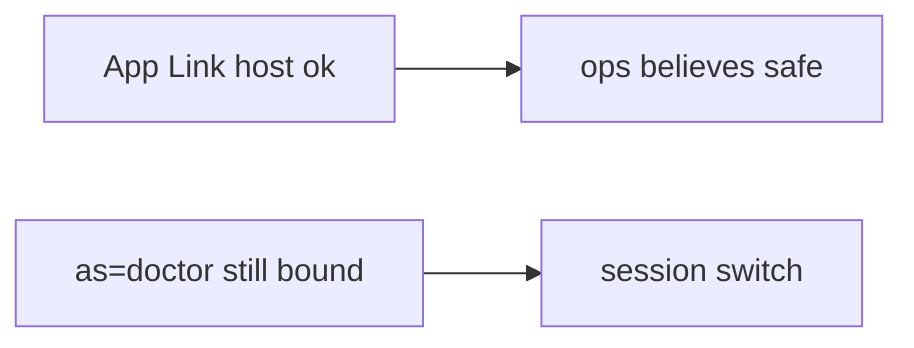

# Same idea on a clinic deep link that sets as=doctor

**Kind:** transfer-challenge
**Loop step:** 7 Transfer

## Use it somewhere new

You get a clinic deep link `as=doctor`. Also name OAuth redirect to the app (4.5).

After `open_link({"as": "admin"})`, `current_user()` must still be `"alice"`.

An EHR-lite claimed HTTPS app link `open?as=doctor` “for kiosk demos,” plus App Links verified.

## Picture: verified host is not a principal

`as=doctor` is the same extra as `as=admin`. If the kiosk demo uses a verified host while `open_link` copies `as`, the rule is gone. HTTPS, App Links, and `exported=false` without a test do not keep alice. OAuth redirect to the app (4.5) and WebView bridges are the same extras family — name them, do not run those systems here. Claimed HTTPS still wants a real host; custom schemes remain hijackable.

| Notes app | Clinic sketch |
|---|---|
| Other app on the tablet sending extras | Same — not a live clinic |
| `open_link({"as": "admin"})` | Clinic deep link `as=doctor` |
| Server session is what you trust | Same; App Links and https are not identity |
| WebView / custom-scheme leftover | Same extras family — name them, do not run them here |

## Write this for a clinic deep link as=doctor

1. who might try (another app on the tablet sending extras — not a live clinic);
2. what you trust (server session is what you trust; App Links and https are not identity);
3. what must not happen (`current_user` becomes doctor, not “HIPAA”);
4. deeplink must not switch user — **local** practice files (no sideloaded malware);
5. leftover risk (WebView, custom schemes, 4.5 audience);
6. when a human error path exists (exit the WebView with a keyboard).

`as=doctor` keeps the signed-in user. Verifying App Links without an `as=` deny check leaves the session switch. The local check is `test_deeplink_as_param_does_not_switch_user` — on the practice files, not a sideloaded malware APK.

## What is not good enough

| Reject | Why |
|---|---|
| “App Links verified” | Host, not identity |
| Live clinic / malware APK | Course rules |
| “WebView is Chrome” | Another interpreter (6.2) |
| HTTPS as identity | Transport, not principal |
| Activity launched as this rule | Wrong observation |

## Practice

Ignore `as=` on the incoming link. Keep the answer keys closed. `labs/8.3/8.3-lab` is the only running system you may break. Do not send Intents at a public host.

## What this page is not doing

Do not try live-target IPC. Do not use real doctor accounts. This page does not finish a check-in.
