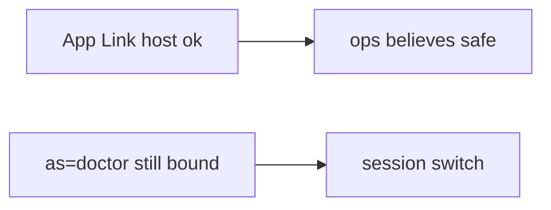

# 8.3-LO-07 — Transfer: clinic deep link as=doctor

**Kind:** transfer-challenge
**Loop step:** 7 Transfer
**Standards:** OWASP MASVS 2.1.0 (final) `MASVS-PLATFORM-1`. RFC 8252 for native OAuth.

## Change the workplace; keep the session off the query string

Do not answer with a Top 10 / CWE / scanner as the definition of security.

**Prompt:** Clinic deep link `as=doctor`. Also name OAuth redirect to app (4.5).

**Product sketch:** EHR-lite `https://clinic.example/open?as=doctor` “for kiosk demos,” App Links verified.

Rewrite the SecureCollab sentence. Include:

1. attacker capabilities (another app on the tablet sending extras — not a live clinic);
2. trust assumptions (server session is TCB; App Links and https are not identity);
3. forbidden outcome (`current_user` becomes doctor, not “HIPAA”);
4. a test idea on a **local** fixture only (no sideloaded malware);
5. residual (WebView, custom schemes, RFC 8252, 4.5 audience);
6. WCAG if a human error path exists (exit the WebView with a keyboard).

## Mental model: verified host is not a principal

## What graders reject

| Reject | Why |
|---|---|
| “App Links verified” | Host, not identity |
| Live clinic / malware APK | Lab policy |
| “WebView is Chrome” | PLATFORM-2 / 6.2 |

## Practice

One page. No keys. `labs/8.3/8.3-lab` is the only running system you may break.
