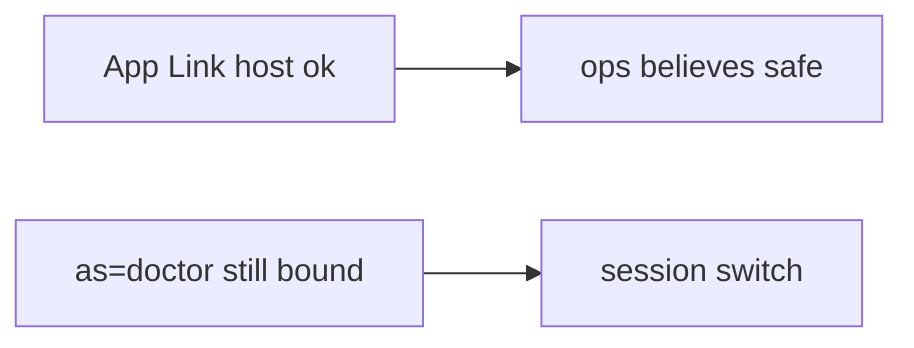

# 8.3-LO-07 — Transfer: clinic deep link as=doctor

**Kind:** transfer-challenge
**Loop step:** 7 Transfer
**Standards:** OWASP MASVS 2.1.0 (final) `MASVS-PLATFORM-1`. RFC 8252 (final) for native OAuth. ASVS `v5.0.0-8.3.1`. Do not use MASVS L1/L2/R.

## Change the workplace; keep the session off the query string

Do not answer with a Top 10 / CWE / scanner as the definition of security. The SecureCollab sentence was: after `open_link({"as": "admin"})`, `current_user()` must still be `"alice"`. Rewrite it for a clinic without changing the fork.

**Prompt:** Clinic deep link `as=doctor`. Also name OAuth redirect to app (4.5).

**Product sketch:** EHR-lite claimed HTTPS app link `open?as=doctor` “for kiosk demos,” App Links verified.

Rewrite the SecureCollab sentence. Include:

1. attacker capabilities (another app on the tablet sending extras — not a live clinic);
2. trust assumptions (server session is TCB; App Links and https are not identity);
3. forbidden outcome (`current_user` becomes doctor, not “HIPAA”);
4. a test idea on a **local** fixture only (no sideloaded malware);
5. residual (WebView, custom schemes, RFC 8252, 4.5 audience);
6. WCAG if a human error path exists (exit the WebView with a keyboard).

Do not instruct attacks on real hospital or vendor endpoints. Use synthetic clinic names.

## Mental model: verified host is not a principal

If the kiosk demo uses a verified host while `open_link` copies `as`, the cell is gone. HTTPS, App Links, and `exported=false` without a test do not keep alice. OAuth redirect to app (4.5) and WebView bridges are the same extras family — name them, do not run those systems here. RFC 8252 still wants claimed HTTPS; custom schemes remain hijackable.

The clinic rewrite still has to keep the SecureCollab fork: `as=doctor` keeps the signed-in user. Verifying App Links without an `as=` deny test leaves the session switch. The local pytest analogue is `test_deeplink_as_param_does_not_switch_user` — on a fixture, not a sideloaded malware APK.

## What graders reject

| Reject | Why |
|---|---|
| “App Links verified” | Host, not identity |
| Live clinic / malware APK | Lab policy |
| “WebView is Chrome” | PLATFORM-2 / 6.2 |
| HTTPS as identity | Transport, not principal |
| Activity launched as this cell | Wrong observation |

## Practice

One page. No keys. `labs/8.3/8.3-lab` is the only running system you may break. Do not send Intents at a public host.

## Non-goals

Live-target IPC. Real doctor accounts. Claiming Gate 8 from this page.
