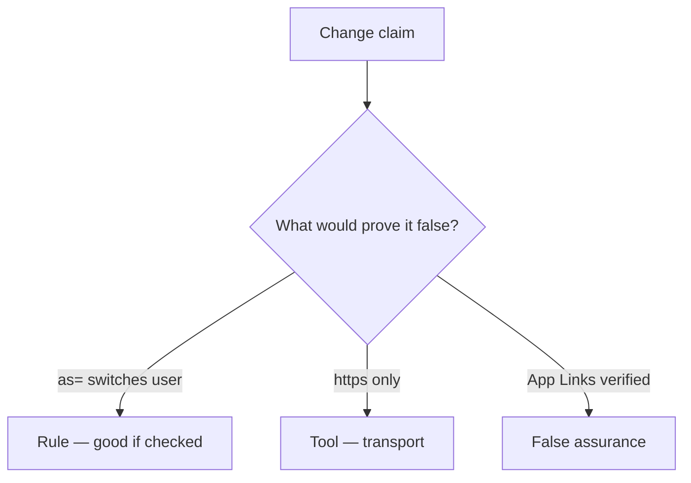

# Would you merge this extras as=?

**Kind:** code-review
**Loop step:** Review

The answers are not on this page. Do not open the keys file until someone has looked at your review.

## What you are reviewing

A colleague ships the notes app’s App Link handling. Review `labs/8.3/8.3-lab/vulnerable/` as that change. Check whether `open_link({"as": "admin"})` still switches `current_user()`, compare that with the rule, and write changes a developer can verify.

The check you already ran (`test_deeplink_as_param_does_not_switch_user`) is the rule check. A comment “we should ignore extras later” is not. An App Links screenshot is not this review.

## Picture: current_user = extras['as']

**`current_user = extras['as']`**. Label it **rule**, **tool**, or **false assurance** before you accept the change.

What has to stay true: alice unchanged. If that call never includes “ignore identity keys”, that session switch is still open. An App Links screenshot without that check is still the same problem.

WebView `addJavascriptInterface` and custom schemes are other IPC holes — name them, do not skip `test_deeplink_as_param_does_not_switch_user`.

## Problems to find (name them yourself)

- `current_user = extras['as']`
- Exported Activity without a permission
- WebView `addJavascriptInterface` too wide
- No `as=` test

Also reject: live malware APKs; closing findings without re-running `test_deeplink_as_param_does_not_switch_user`; keys in learner notes.

## Common mix-ups this topic refuses

- HTTPS App Links are trusted input
- WebView is just Chrome so 2.3 applies unchanged
- IPC is private to our app
- `exported=false` without a test is this rule
- A verified-host tile is the rule

## Practice

Write three review notes a peer could act on. Each note: what you saw, rule or false assurance, suggested structural change, leftover you will **not** delete. Tie at least one note to `test_deeplink_as_param_does_not_switch_user`. Do not open the keys file.

## Use it somewhere new

A clinic change that “verified App Links” without an `as=` deny check is an incomplete review. Name the independent falsehood that would still keep alice.

## What this page is not doing

Do not merge by adding a comment “will ignore extras later.” That comment is leftover without an owner. Do not install a malware APK to prove the finding.
