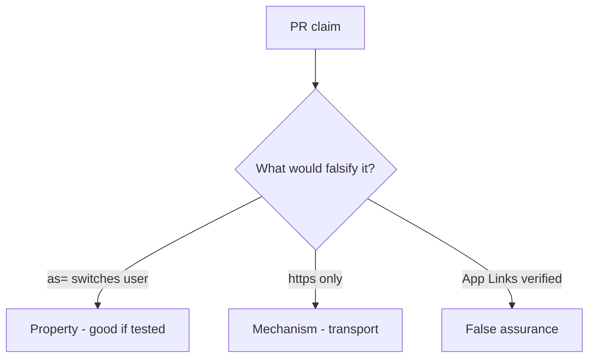

# 8.3-LO-08 — Review extras as= as a PR, not an App Links sticker

**Kind:** code-review
**Loop step:** Review
**Standards:** OWASP MASVS 2.1.0 (final) `MASVS-PLATFORM-1`.

## Review the fixture as if it were SecureCollab App Link handling

Review `labs/8.3/8.3-lab/vulnerable/` as a SecureCollab PR. Intended findings live only in `content/assessment/keys/8.3.md` — not here.

## Mental model: property, mechanism, or false assurance

Seeded smells (label them yourself; do not open the keys file):

- `current_user = extras['as']`
- Exported Activity without a permission
- WebView `addJavascriptInterface` too wide
- No `as=` test

Also reject: live malware APKs, keys in lessons.

## Misconceptions

- HTTPS App Links are trusted input
- WebView is just Chrome so 2.3 applies unchanged
- IPC is private to our app

## Practice

Write three review notes. Tie at least one to `test_deeplink_as_param_does_not_switch_user`.

## Transfer

Clinic PR that “verified App Links” without an `as=` deny test is incomplete.
