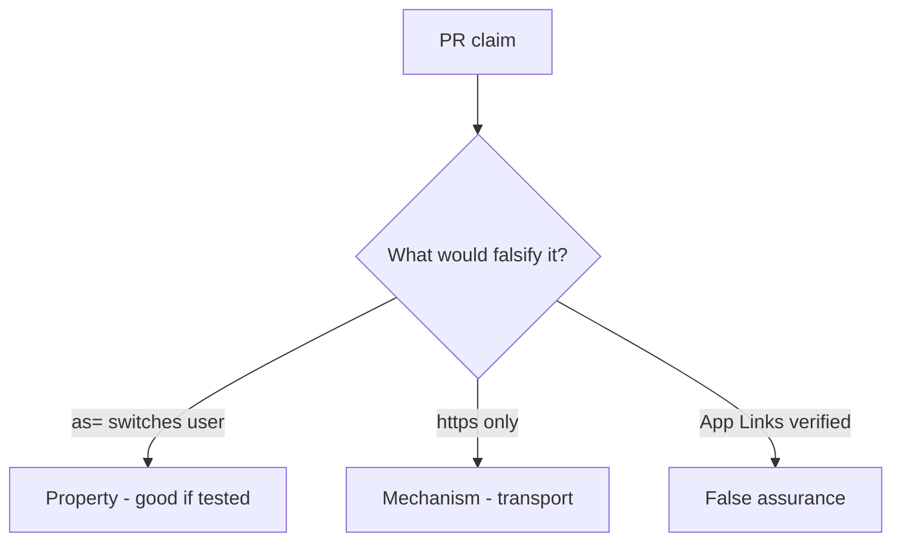

# 8.3-LO-08 — Review extras as= as a PR, not an App Links sticker

**Kind:** code-review
**Loop step:** Review
**Standards:** OWASP MASVS 2.1.0 (final) `MASVS-PLATFORM-1`. Do not use MASVS L1/L2/R.

## Review the fixture as if it were SecureCollab App Link handling

Review `labs/8.3/8.3-lab/vulnerable/` as a SecureCollab PR. Your job is not to count suspicious lines. Reconstruct whether `open_link({"as": "admin"})` still switches `current_user()`, compare that with the module invariant, and write changes a developer can verify.

Intended findings live only in `content/assessment/keys/8.3.md` — not here. Do not open the keys file until your review has been evaluated.

## Mental model: current_user = extras['as']

Start with this seeded smell: **`current_user = extras['as']`**. Label it property, mechanism, or false assurance before you accept the PR.

Classification starts at the protected effect (alice unchanged). Everything that is not “ignore identity keys” at that call is a candidate session switch. An App Links screenshot without that pytest is the same smell, not a different finding class.

WebView `addJavascriptInterface` and custom schemes are other IPC holes — name them, do not skip `test_deeplink_as_param_does_not_switch_user`.

## Seeded smells (label them yourself)

- `current_user = extras['as']`
- Exported Activity without a permission
- WebView `addJavascriptInterface` too wide
- No `as=` test

Also reject: live malware APKs; closing findings without re-running `test_deeplink_as_param_does_not_switch_user`; keys in lessons.

## Misconceptions this module refuses

- HTTPS App Links are trusted input
- WebView is just Chrome so 2.3 applies unchanged
- IPC is private to our app
- `exported=false` without a test is this cell
- MASVS L1/L2/R are current levels

## Practice

Write three review notes a maintainer could act on. Each note: observation, property or false assurance, suggested structural change, residual you will **not** delete. Tie at least one to `test_deeplink_as_param_does_not_switch_user`.

## Transfer

Clinic PR that “verified App Links” without an `as=` deny test is an incomplete authenticity review. Name the independent falsehood that would still keep alice.

## Non-goals

Do not merge by adding a comment “will ignore extras later.” That comment is a residual without an owner. Do not install a malware APK to prove the finding.
