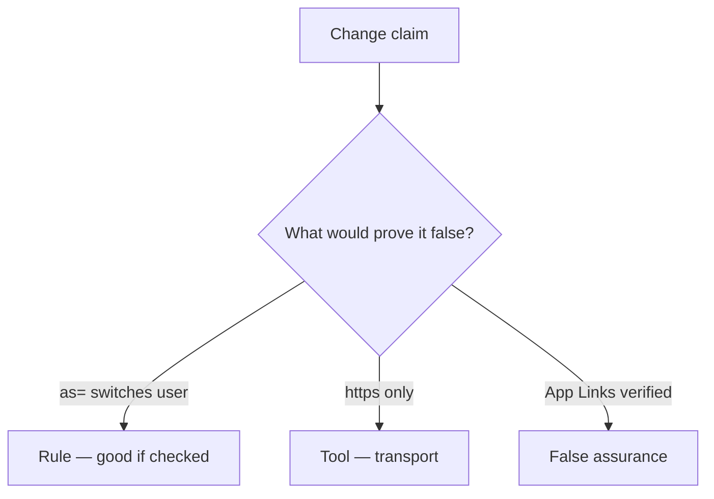

# Would you merge this extras as=?

**Kind:** code-review
**Loop step:** Review

## What you are reviewing

Read `labs/8.3/8.3-lab/vulnerable/` as App Link handling. Does `open_link({"as": "admin"})` still switch `current_user()`?

Do not treat “we should ignore extras later” as a green `test_deeplink_as_param_does_not_switch_user`. An App Links screenshot does not stop `as=admin`.

## Picture: current_user = extras['as']

**`current_user = extras['as']`**.

Alice still has to stay unchanged. If the change never ignores identity keys, that session switch is still open. An App Links screenshot without that check is still the same problem.

WebView `addJavascriptInterface` and custom schemes are other IPC holes — name them, do not skip `test_deeplink_as_param_does_not_switch_user`.

## Problems to find (name them yourself)

- `current_user = extras['as']`
- Exported Activity without a permission
- WebView `addJavascriptInterface` too wide
- No `as=` test

Also reject: live malware APKs; closing findings without re-running `test_deeplink_as_param_does_not_switch_user`; keys in learner notes.

## Common mix-ups this topic refuses

- HTTPS App Links are trusted input
- WebView is just Chrome so 2.3 applies unchanged
- IPC is private to our app
- `exported=false` without a test is this rule
- A verified-host tile is the rule

## Use it somewhere new

Verified App Links without an `as=` deny still let the extras switch the user. Verified App Links are not an `as=` deny — write the alice-stays-signed-in check.

## What this page is not doing

A deeplink that still switches the user, plus “will ignore extras later,” is leftover with no owner. Do not install a malware APK to prove the finding.
