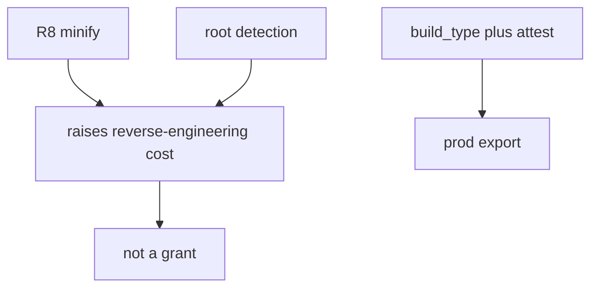
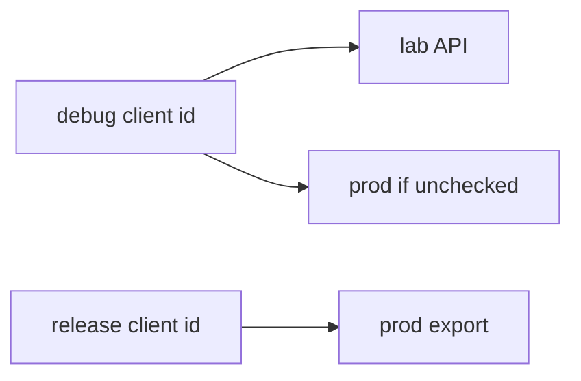

# Raising cost is not the same as trust

**Kind:** concept-model
**Loop step:** 1 Property

## The rule

The notes app this week ships a debug APK for developers and a release APK for members. Production export is a **server** decision (8.1). A debug-signed lab build must not call that API even if the client sends `attest=ok`. Channel plus build type sit next to attest in what the server trusts.

> `api_allowed("debug", "ok")` must be false. `api_allowed("release", "ok")` may be true.

What must not happen: **a debug build is allowed to call production export**. That is integrity of the release channel — debug loggers, extra menus, leftover keys (5.3) pointed at prod data.

Root detection, minify, and anti-tamper **raise an attacker’s cost**. They do not make the APK honest (8.1). Testing profiles that emphasize resilience are **profiles in a testing guide**, not a current “R level” of a mobile-app list.

## Picture: cost versus grant



## Picture: two client identities



Play App Signing protects *store* signing. It does not stop a debug application id from using a leaked prod API key.

**A tool is not the rule.** `minifyEnabled`, a SafetyNet brand name, “we hide the URL.”

## Why it happens, what it costs, how you stop it, how you notice, how you recover

| Slice | For this rule |
|---|---|
| Why it happens | Prod API trusts `attest=ok` from any build |
| What has to be true first | `api_allowed('debug','ok')` is true |
| Trigger | Leaked debug APK or student flavor |
| What it costs | Debug keys and loggers against prod data |
| How you stop it | Separate client ids; server checks build plus attest; no prod URLs in debug manifests |
| How you notice | `debug_to_prod_denied` |
| How you recover | Revoke the debug client id; rotate leftover keys (5.3) |

## What the framework does vs what you still have to check

Gradle `debug` / `release` types are not a server check. R8 does not authorize. Play Console “app signing” is not “secrets stay out of the binary.” FastAPI will accept `attest=ok` from a debug client if you bind it.

The app’s promise is: **this** helper, debug plus ok is false. The practice folder is `labs/8.4/8.4-lab`. It is local only. It is not a live store.

## What the tool cannot do

- Root detection is bypassable (8.1).
- A repackaged release still works if signing keys leak (5.3).
- Attestation farms remain.
- Embedded API identifiers will be recovered — assume that.
- Debug *should* still reach a **lab** API.

## Can people still use it

Developers still need a debug build against **lab** data. Do not ship a spinner that retries prod forever when denied. Announce “use the lab environment.”

## Practice

Where are signing keys; who can push to the store. Then run:

```text
python3 -m pytest labs/8.4/8.4-lab/tests --impl vulnerable
python3 -m pytest labs/8.4/8.4-lab/tests --impl fixed
```

The first command must fail. The second must pass.

## Use it somewhere new

Clinic debug build against prod FHIR. A list of what shipped in the APK (10.2).

## What this page is not doing

Live Play Console, unpacking public APKs, anti-debug cookbooks. Opening this page does not finish a check-in. Answer keys are not on this site.
