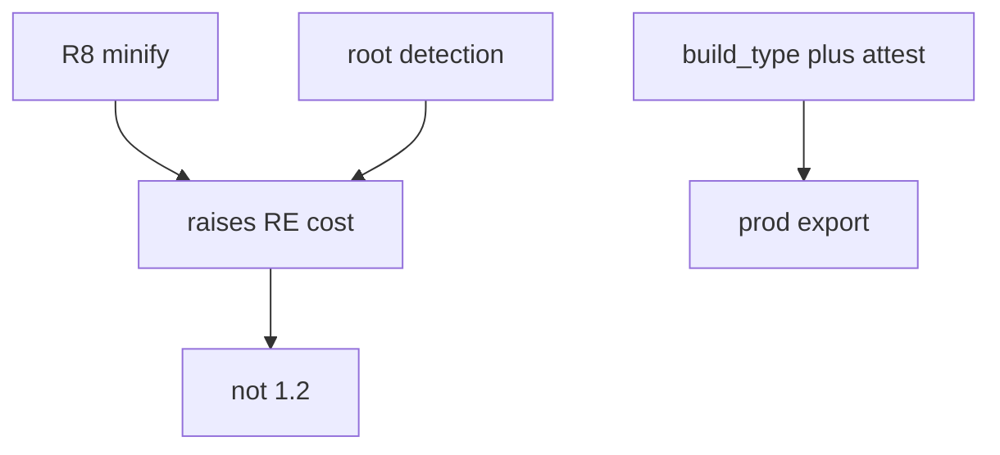
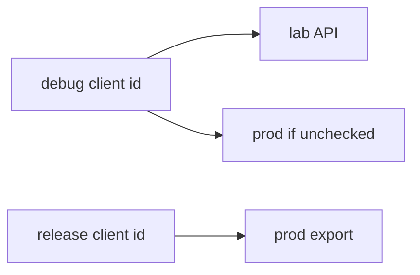

# 8.4-LO-01 — Resilience raises cost; it is not trust

**Kind:** concept-model
**Loop step:** 1 Property
**Standards:** OWASP MASVS 2.1.0 (final) `MASVS-CODE`, `MASVS-RESILIENCE-1`, `MASVS-RESILIENCE-2`. ASVS `v5.0.0-13.3.1`, `v5.0.0-8.3.1`. MASTG 2.0.0 testing profiles — not MASVS L1/L2/R.

## The claim this module owns

SecureCollab ships a debug APK for developers and a release APK for members. Production export is a **server** decision (8.1). A debug-signed lab build must not call that API even if the client sends `attest=ok`. Channel + build type belong in the TCB next to attest.

> `api_allowed("debug", "ok")` must be false. `api_allowed("release", "ok")` may be true.

The forbidden outcome is **debug build allowed to call production export**. That is integrity of the release channel — debug loggers, extra menus, leftover keys (5.3) pointed at prod data.

MASVS-RESILIENCE-1 (platform integrity) and RESILIENCE-2 (anti-tampering) **raise an attacker’s cost**. They do not make the APK honest (8.1). MAS Testing Profiles that emphasize resilience are **profiles in MASTG**, not a current MASVS “R level.”

## Mental model: cost versus grant



## Mental model: two client identities



Play App Signing protects *store* signing; it does not stop a debug applicationId from using a leaked prod API key.

**Mechanism (not the property):** `minifyEnabled`, SafetyNet brand, “we hide the URL.”

## Root cause vs impact vs prevention vs detection vs recovery

| Slice | For this property |
|---|---|
| Root cause | Prod API trusts `attest=ok` from any build |
| Preconditions | `api_allowed('debug','ok')` true |
| Trigger | Leaked debug APK or student flavor |
| Impact | Debug keys/loggers against prod data |
| Prevention | Separate client ids; server checks build + attest; no prod URLs in debug manifests |
| Detection | `debug_to_prod_denied` |
| Recovery | Revoke debug client id; rotate (5.3) |

## Framework defaults versus the channel guarantee

Gradle `debug`/`release` types are not a server check. R8 does not authorize. Play Console “app signing” is not 13.3.1.

## Mechanism limits

- Root detection is bypassable (8.1).
- Repackaged release if signing keys leak (5.3).
- Attestation farms.
- Embedded API identifiers will be recovered — assume that (CODE).

## Usability and accessibility

Developers still need a debug build against **lab** data. Do not ship a spinner that retries prod forever when denied (WCAG 2.2 4.1.3).

## Practice

Where are signing keys; who can push to the store. Then run:

```
python3 -m pytest labs/8.4/8.4-lab/tests --impl vulnerable
python3 -m pytest labs/8.4/8.4-lab/tests --impl fixed
```

The first command must fail. The second must pass.

## Transfer

Clinic debug build against prod FHIR. SBOM of the APK (10.2).

## Non-goals

Live Play Console, unpacking public APKs, anti-Frida cookbooks. Gates 0–10 and M0–M5 stay **not-attempted**. Answer keys are not in this file.
