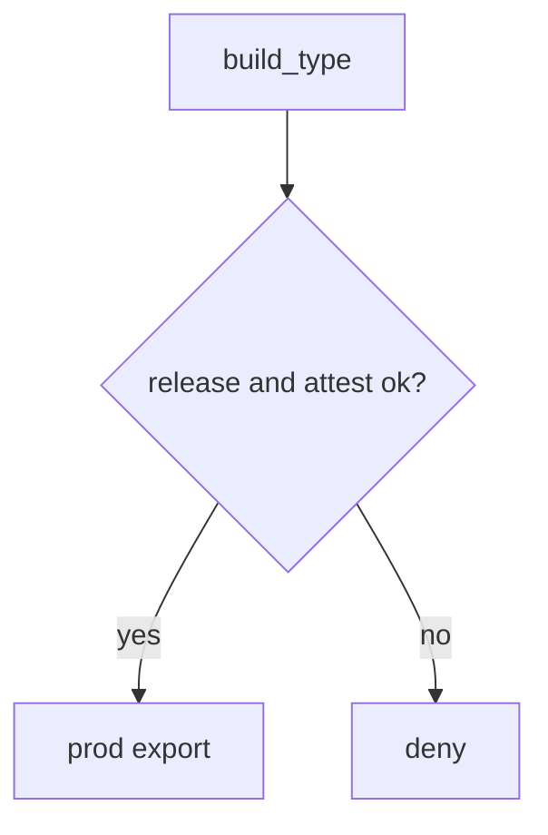
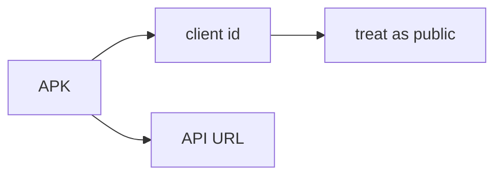

# 8.4-LO-02 — Debug versus release as a server decision

**Kind:** design-exercise
**Loop step:** 2 Model
**Standards:** OWASP MASVS 2.1.0 (final) `MASVS-CODE`. ASVS `v5.0.0-8.3.1`.

## Can a second engineer name pytest cases from your channel map?

“R8 is on” is not this lesson. A reviewable model names **build type, client id, and which API it may call**.

SecureCollab Phase 8 freeze: local `api_allowed(build_type, attest)`. No live stores.

## Mental model: server owns the channel

## Mental model: secrets in the APK will leak

That is 5.3 / `v5.0.0-13.3.1` — not solved by minify.

## Step 1: freeze pieces

| Piece | This system |
|---|---|
| Subjects | leaked debug APK; honest release |
| Objects | prod export API |
| Actions | `api_allowed` |
| Channels | HTTPS from the app |
| TCB | server build+attest check |
| Untrusted | client attest string, R8, root checks |
| State / time | token freshness (8.1 residual) |
| 1.1 cell | integrity of the release channel |

## Step 2: write cells

| Subject | Object | Action | Decision |
|---|---|---|---|
| debug + attest ok | prod export | call | deny |
| release + attest ok | prod export | call | may allow |
| release + attest fail | prod export | call | deny |
| R8 | binary | minify | not TCB |

## Practice

Draw the map. Point at `labs/8.4/8.4-lab` file `build.py`.

## Transfer

Clinic FHIR flavors; 10.2 SBOM.

## Residual risk

Key leak; attestation farms; MASVS-RESILIENCE as cost.

## Non-goals

Top 10 as the definition of security. Keys stay out of lessons.
