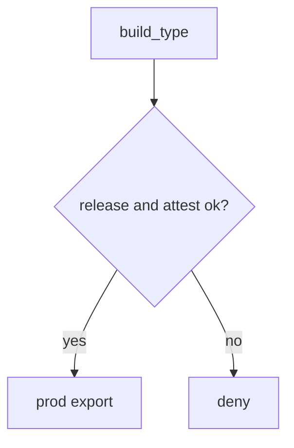
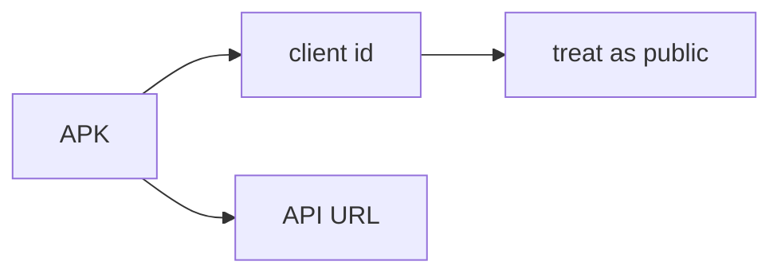

# Debug versus release as a server decision

**Kind:** design-exercise
**Loop step:** 2 Model

## Could someone else name the checks from your map?

“R8 is on” is not this lesson. A map someone else can test names **build type, client id, and which API it may call**.

This week on the notes app: local `api_allowed(build_type, attest)`. No live stores.

## Picture: server owns the channel

## Picture: secrets in the APK will leak

That leftover is 5.3 — secrets in the artifact. Minify does not solve it.

## Step 1: name the pieces

| Piece | This system |
|---|---|
| Who | leaked debug APK; honest release |
| What | prod export API |
| Actions | `api_allowed` |
| Paths | HTTPS from the app |
| What you trust | server build-plus-attest check |
| What you do not trust | client attest string, R8, root checks |
| Time | token freshness (8.1 leftover) |
| Authorization cell | integrity of the release channel |

## Step 2: write cells the practice can fail

| Who | What | Action | Decision |
|---|---|---|---|
| debug + attest ok | prod export | call | deny |
| release + attest ok | prod export | call | may allow |
| release + attest fail | prod export | call | deny |
| R8 | binary | minify | not what you trust |

## Practice

Open `build.py` in `labs/8.4/8.4-lab`. Label the always-true helper even in the repaired tree — the fix is release plus attest, not pretending minify became a grant.

## Use it somewhere new

Clinic FHIR flavors; a list of what shipped in the APK (10.2).

## What can still go wrong

Key leak (5.3). Attestation farms. Resilience as cost, not as trust.

## What this page is not doing

Answer keys are not on this site.
