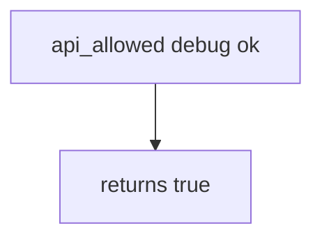

# 8.4-LO-03 — Observe always-true allow, do not reverse a store APK

**Kind:** mechanism-lab
**Loop step:** 3 Break
**Standards:** OWASP MASVS 2.1.0 (final) `MASVS-CODE`.

## Authorized scope

`labs/8.4/8.4-lab` only. Synthetic build_type strings. No live Play Console, no unpacking public APKs.

**Forbidden outcome:** Debug build allowed to call production export.

## Mental model: attest string is enough



The vulnerable tree demonstrates **cause** (prod trusts any build). Do not attack store listings.

## What to read in the fixture

`vulnerable/build.py` returns true for every pair. Tests require debug+ok to be false.

## Root cause vs impact

| Slice | Lab |
|---|---|
| Root cause | Prod trusts attest from any build |
| Impact | Debug channel against prod |
| Not the lesson | Resilience checklist as the definition |

## Practice

```
python3 -m pytest labs/8.4/8.4-lab/tests --impl vulnerable
```

Record `test_debug_build_cannot_call_prod_export`. Do not probe public hosts.

## Transfer

Clinic debug vs FHIR. Predict without leaving this directory.

## Non-goals

No live-target or unpacking instructions.
