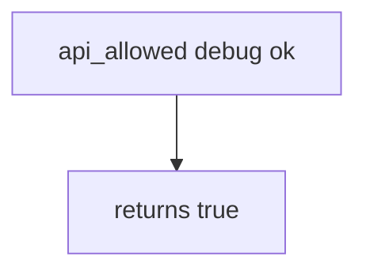

# 8.4-LO-03 — Observe always-true allow, do not reverse a store APK

**Kind:** mechanism-lab
**Loop step:** 3 Break
**Standards:** OWASP MASVS 2.1.0 (final) `MASVS-CODE`. `MASVS-RESILIENCE-1` / `MASVS-RESILIENCE-2` raise cost; they are not this oracle. ASVS 5.0.0 (final) `v5.0.0-13.3.1`, `v5.0.0-8.3.1`. MASTG 2.0.0 testing profiles — not MASVS L1/L2/R.

## Authorized scope

`labs/8.4/8.4-lab` only. The fixture is an in-process `api_allowed(build_type, attest)`. Synthetic build_type strings (`debug`, `release`). No live Play Console, no unpacking public APKs, no anti-Frida cookbooks.

**Forbidden outcome:** Debug build allowed to call production export. `api_allowed("debug", "ok")` returns true.

Attacker capability in this lab: a leaked debug APK or student flavor. That stands in for a clinic debug flavor that reuses the prod ApplicationId and API key so testers can “hit real data.” Trust assumption: `api_allowed` is supposed to be a **server channel check** next to 8.1 attest. R8, Play App Signing, root detection, and `minifyEnabled` are not in the TCB for this cell.

## Mental model: attest string is enough



The vulnerable tree demonstrates **cause** (prod trusts any build). Do not attack store listings. Preconditions: `api_allowed` returns true for every pair. You do not need Gradle. You must not unpack a store APK.

MASVS-CODE wants secrets out of artifacts (`v5.0.0-13.3.1` on the web/API side). Module 8.1 already said the APK is hostile; this cell is **debug must not call prod even if attest=ok**.

## What to read in the fixture

`vulnerable/build.py` returns true for every pair. Tests:

- `test_debug_build_cannot_call_prod_export`
- `test_release_with_attest_may_call_prod`
- `test_release_without_attest_is_denied` — 8.1 still applies to release

You do not need a new flavor name. The failure of `test_debug_build_cannot_call_prod_export` *is* the evidence.

Do not open the fixed tree yet. Diagnose the cause first.

## Root cause vs impact vs prevention vs detection vs recovery

| Slice | This lab |
|---|---|
| Required property | `api_allowed("debug", "ok")` is false |
| Root cause | Prod API trusts `attest=ok` from any build |
| Preconditions | `api_allowed` is always true |
| Trigger | Leaked debug APK or student flavor |
| Impact | Debug keys/loggers against prod data |
| Prevention | Separate client ids; server checks build + attest; no prod URLs in debug manifests |
| Detection | `debug_to_prod_denied`; never the APK or signing key |
| Recovery | Keep deny; revoke debug client id; rotate (5.3) |
| Not the lesson | Resilience checklist as the definition; live Play; unpacking public APKs |

## Framework defaults versus the channel guarantee

Gradle `debug`/`release` types are not a server check. R8 does not authorize. Play Console “app signing” is not 13.3.1. FastAPI will accept `attest=ok` from a debug client if you bind it. The application guarantee is: **this** fixture, debug plus ok is false.

## Practice

```text
python3 -m pytest labs/8.4/8.4-lab/tests --impl vulnerable
```

Run from `labs/8.4/8.4-lab` if a repo-root collection picks up `site/`. Record `test_debug_build_cannot_call_prod_export`. Do not probe public hosts. An environment error is not security evidence.

## Transfer

Clinic debug vs FHIR. Predict without leaving this directory. Do not unpack a live clinic APK.

## Non-goals

No live-target or unpacking instructions. Synthetic `debug` / `release` only. Do not dump anti-Frida cookbooks.
