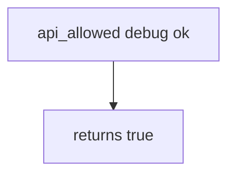

# Practice: a debug build calls prod export

**Kind:** mechanism-lab
**Loop step:** 3 Break

## Try it

The practice is not a store listing you unpack. It is a tiny Python `api_allowed(build_type, attest)`. The failure is already in the function: it returns true for every pair, so a debug build with `attest=ok` is allowed to call prod export. That is a **failed rule**, not a trophy against a public APK.

> `api_allowed("debug", "ok")` must be false. A debug build must not call production export.

## Where you may practice

Stay inside `labs/8.4/8.4-lab`. The helper is an in-process `api_allowed(build_type, attest)`. Fake build-type strings (`debug`, `release`). It does not open a network. Do not probe a live Play Console, unpack a public APK, or paste anti-debug steps onto a store listing.

Do not paste this exercise onto a public host, employer clinic, or live store APK.

What must not happen: **a debug build is allowed to call production export**. `api_allowed("debug", "ok")` returns true.

Who could do this: a leaked debug APK or student flavor. That stands in for a clinic debug flavor that reuses the prod application id and API key so testers can “hit real data.” What is supposed to stop this: `api_allowed` is supposed to be a **server channel check** next to 8.1 attest. R8, Play App Signing, root detection, and `minifyEnabled` are not enough.

## Picture: attest string is enough



The broken files show **cause** (prod trusts any build). Do not attack store listings. What has to be true first: `api_allowed` returns true for every pair. You do not need Gradle. You must not unpack a store APK.

Topic 8.1 already said the APK is hostile. This rule is **debug must not call prod even if attest=ok**. Secrets in the APK are a 5.3 leftover, not this grant.

## What to read in the broken files

`vulnerable/build.py` returns true for every pair. Checks:

- `test_debug_build_cannot_call_prod_export`
- `test_release_with_attest_may_call_prod`
- `test_release_without_attest_is_denied` — 8.1 still applies to release

You do not need a new flavor name.
## Why it happens vs what it costs

| Slice | This practice |
|---|---|
| Required rule | `api_allowed("debug", "ok")` is false |
| Why it happens | Prod API trusts `attest=ok` from any build |
| What has to be true first | `api_allowed` is always true |
| Trigger | Leaked debug APK or student flavor |
| What it costs | Debug keys and loggers against prod data |
| How you stop it | Separate client ids; server checks build plus attest; no prod URLs in debug manifests |
| How you notice | `debug_to_prod_denied`; never the APK or signing key |
| How you recover | Keep deny; revoke the debug client id; rotate leftover keys (5.3) |
| Not the lesson | A resilience checklist as the definition; live Play; unpacking public APKs |

## What the framework does vs what you still have to check

Gradle `debug` / `release` types are not a server check. R8 does not authorize. Play Console “app signing” is not “secrets stay out of the binary.” FastAPI will accept `attest=ok` from a debug client if you bind it. What this practice is supposed to show: debug plus ok is false.

## Practice

```text
python3 -m pytest labs/8.4/8.4-lab/tests --impl vulnerable
```

Run from `labs/8.4/8.4-lab` if a repo-root collection picks up `site/`. Do not “fix” the check to pass. Do not probe public hosts. A setup error is not proof the rule holds.

## Use it somewhere new

Clinic debug vs FHIR. Predict without leaving this directory. Do not unpack a live clinic APK.

## What this page is not doing

No live-target or unpacking steps. Fake `debug` / `release` strings only. Do not dump anti-debug cookbooks.
