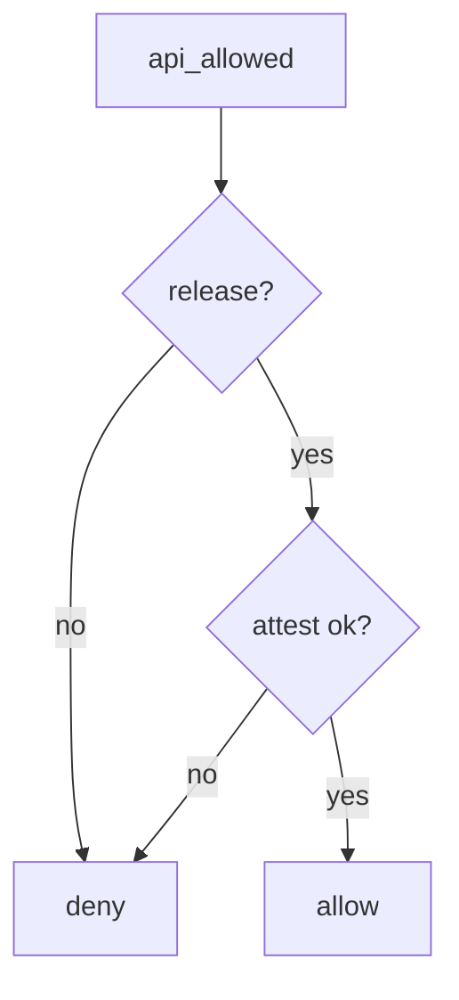

# Allow only release plus server attest

**Kind:** design-exercise
**Loop step:** 4 Build

## The rule

R8 is not the fix. Root detection is not the fix. Play App Signing is not the fix. A resilience sticker is not the fix.

The structural change is: the server **checks build type**. `api_allowed` must require `build_type == "release"` **and** `attest == "ok"` (a stand-in here for server-checked attest from 8.1). Debug never reaches prod. Allow only release plus server attest.

The smallest restore for the notes app’s prod export is: debug plus ok denies. Fail-safe: unknown build type denies. Do not accept a client-only minify flag. Do not fail open because “testers need real data.”

## Picture: attest and not-debug both gates



The repaired files require both gates. Production still needs separate client ids and no prod URLs in debug manifests. Play App Signing protects *store* signing; it does not stop a debug application id from using a leaked prod API key. Embedded API identifiers will be recovered — assume that. Root detection is bypassable (8.1).

Industry lists ask for a trusted service layer, and they want secrets out of artifacts. The check below is that sentence for `api_allowed("debug", "ok")`.

## What the repaired files must show

| After the fix | Must be true |
|---|---|
| debug + ok | false |
| release + ok | true |
| release + fail | false |

Fail closed: if the build is not release, **do not allow prod export**. Do not keep an always-true helper because “minify is on.”

## What this is not

- R8.
- Root detection.
- Play App Signing.
- A resilience sticker.
- `minifyEnabled`.
- Hiding the URL.
- An old mobile-app “R level” (obsolete; resilience lives in testing profiles).

## What the tool cannot do

- Root detection is bypassable (8.1).
- A repackaged release still works if signing keys leak (5.3).
- Attestation farms remain.
- Embedded API identifiers will be recovered — assume that.
- Debug *should* still reach a **lab** API.
- An APK inventory list (10.2) is a list of what shipped, not this channel check.

## Practice

Name the predicate (`build_type == "release"` and `attest == "ok"`). Run:

```text
python3 -m pytest labs/8.4/8.4-lab/tests --impl fixed
```

Must pass. Run from the lab directory if collection at repo root is polluted. Then write one sentence: which rule is restored, and which leftover you refused to delete.

## Use it somewhere new

A clinic example: stop pointing the debug flavor at production FHIR.

## What can still go wrong

Stolen release signing keys (5.3). Attestation farms. 8.1 still applies to release APKs. APK inventory (10.2).

## What this page is not doing

Do not unpack a store APK. Do not claim Gate 8 from an R8 screenshot. Do not teach old mobile-app L1/L2/R labels as current levels.
