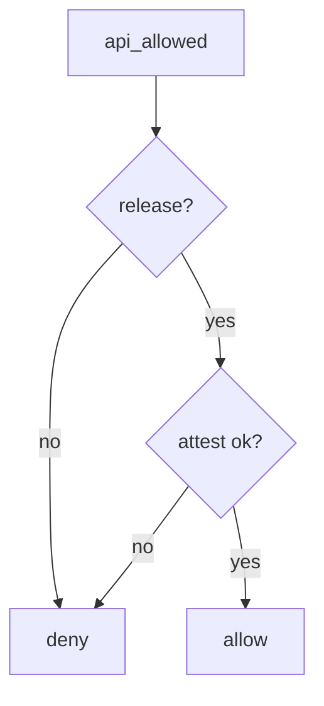

# 8.4-LO-04 — Allow only release plus server attest

**Kind:** design-exercise
**Loop step:** 4 Build
**Standards:** OWASP ASVS 5.0.0 (final) `v5.0.0-8.3.1`, `v5.0.0-13.3.1`. MASVS 2.1.0 (final) `MASVS-CODE`. RESILIENCE-1/2 raise cost; they are not this grant.

## Structural means the server checks build type

`api_allowed` must require `build_type == "release"` **and** `attest == "ok"` (lab stand-in for server-verified attest from 8.1). Debug never reaches prod. Structural means that conjunction — not R8, not root detection, not Play App Signing, not a resilience sticker.

The smallest restore for SecureCollab prod export is: debug plus ok denies. Fail-safe: unknown build type denies. Do not accept a client-only minify flag. Do not fail open because “testers need real data.”

## Mental model: attest and not-debug both gates



The lab’s fixed tree requires both gates. Production still needs separate client ids and no prod URLs in debug manifests. Play App Signing protects *store* signing; it does not stop a debug applicationId from using a leaked prod API key. Embedded API identifiers will be recovered — assume that (CODE). Root detection is bypassable (8.1).

ASVS `v5.0.0-8.3.1` wants the trusted service layer; `v5.0.0-13.3.1` wants secrets out of artifacts. This pytest is that sentence for `api_allowed("debug", "ok")`.

## Why this restores the cell

| After the fix | Must be true |
|---|---|
| debug + ok | false |
| release + ok | true |
| release + fail | false |

## What this is not

R8. Root detection. Play App Signing. A resilience sticker. `minifyEnabled`. Hiding the URL. MASVS “R level” (obsolete; profiles live in MASTG).

## Mechanism limits

- Root detection is bypassable (8.1).
- Repackaged release if signing keys leak (5.3).
- Attestation farms.
- Embedded API identifiers will be recovered — assume that (CODE).
- Debug *should* still reach a **lab** API.
- 10.2 APK SBOM is inventory, not this channel check.

## Practice

Name the predicate (`build_type == "release"` and `attest == "ok"`). Run:

```text
python3 -m pytest labs/8.4/8.4-lab/tests --impl fixed
```

Must pass. Run from the lab directory if collection at repo root is polluted.

## Transfer

Clinic: stop pointing the debug flavor at production FHIR.

## Residual risk

Stolen release signing keys (5.3); attestation farms; 8.1 still applies to release APKs; 10.2 SBOM.

## Non-goals

Do not unpack a store APK. Do not claim Gate 8 from an R8 screenshot. Do not teach MASVS L1/L2/R as current levels.
