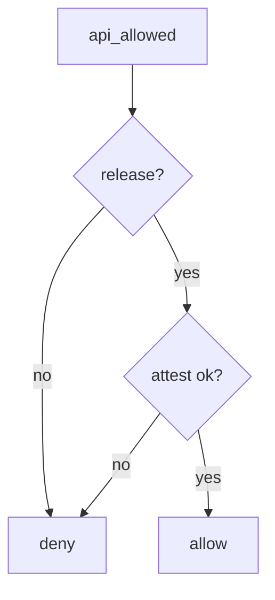

# 8.4-LO-04 — Allow only release plus server attest

**Kind:** design-exercise
**Loop step:** 4 Build
**Standards:** OWASP ASVS 5.0.0 (final) `v5.0.0-8.3.1`. MASVS 2.1.0 `MASVS-CODE`.

## Structural means the server checks build type

`api_allowed` must require `build_type == "release"` **and** `attest == "ok"` (lab stand-in for server-verified attest from 8.1). Debug never reaches prod.

## Mental model: both gates



Fail-safe: unknown build type denies. Do not accept a client-only minify flag.

## Why this restores the cell

| After the fix | Must be true |
|---|---|
| debug + ok | false |
| release + ok | true |
| release + fail | false |

## What this is not

R8. Root detection. Play App Signing. A resilience sticker.

## Practice

Name the predicate. Run:

```
python3 -m pytest labs/8.4/8.4-lab/tests --impl fixed
```

Must pass.

## Transfer

Clinic: stop pointing the debug flavor at production FHIR.

## Residual risk

Stolen release signing keys (5.3); attestation farms; 8.1 still applies to release APKs.
