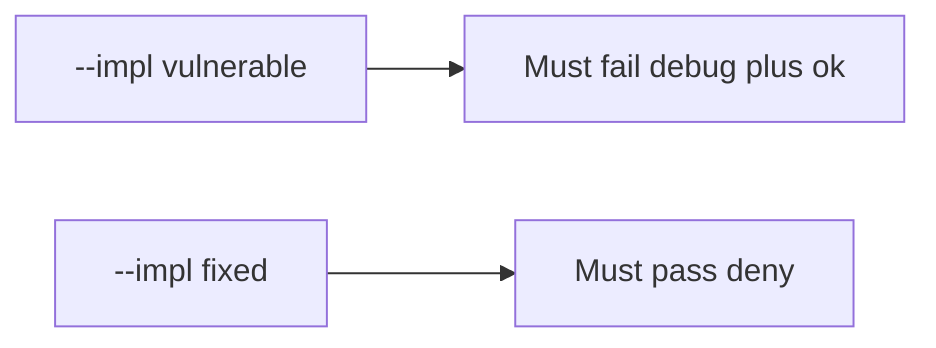

# 8.4-LO-05 — Evidence is debug denied, then a passing pair

**Kind:** verification-lab
**Loop step:** 5 Verify
**Standards:** OWASP MASVS 2.1.0 (final) `MASVS-CODE`.

## An invariant that cannot fail a test is still a slogan

“minifyEnabled is true” is not evidence. The oracle is the local pair. Do not unpack store APKs.

## Mental model: vulnerable must fail: debug plus ok

The failing observation on `--impl vulnerable` is **debug plus ok**. A passing collection count is not this cell.



| Case | Must show |
|---|---|
| Negative / abuse | debug + ok → false |
| Normal | release + ok → true |
| Negative | release + fail → false |
| Not claimed | real Play Integrity; R8; live signing |

```
python3 -m pytest labs/8.4/8.4-lab/tests --impl vulnerable
python3 -m pytest labs/8.4/8.4-lab/tests --impl fixed
```

Honest release+ok may pass on both.

## What the tests do not prove

- Hardware-backed signing
- MASVS-RESILIENCE on a physical device
- That debug cannot reach a *lab* API (it should)

## Practice

Execute both implementations. Map each test to an LO-02 cell.

## Transfer

Clinic: a test that only asserts the debug APK builds is not this cell.
