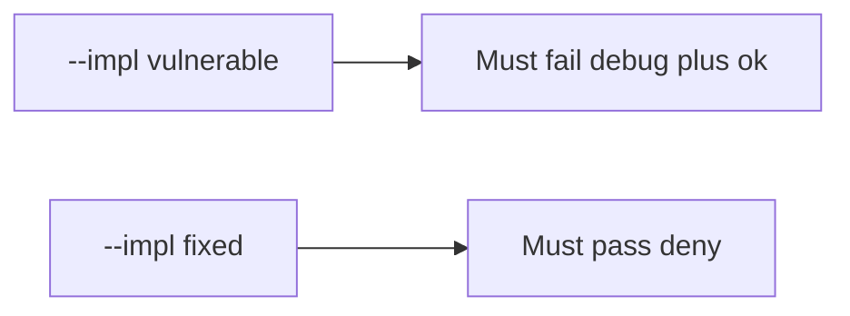

# 8.4-LO-05 — Evidence is debug denied, then a passing pair

**Kind:** verification-lab
**Loop step:** 5 Verify
**Standards:** OWASP MASVS 2.1.0 (final) `MASVS-CODE`. ASVS 5.0.0 (final) `v5.0.0-8.3.1`.

## An invariant that cannot fail a test is still a slogan

“minifyEnabled is true” is not evidence. “Play App Signing is on” is a mechanism observation. The oracle is: `api_allowed("debug", "ok")` is false and `api_allowed("release", "ok")` may be true. The debug-plus-ok observation must be **false** on `--impl vulnerable` (returns true) and **true** on `--impl fixed`. Do not unpack store APKs.

## Mental model: vulnerable must fail: debug plus ok

The failing observation on `--impl vulnerable` is **debug plus ok**. A passing collection count is not this cell.



| Mode | Must show for this module |
|---|---|
| Negative / abuse | debug + ok → false; vulnerable must fail |
| Normal | release + ok → true (may pass on both) |
| Negative | release + fail → false |
| Not claimed | real Play Integrity; R8; live signing; hardware-backed keys |

Lab tests in `labs/8.4/8.4-lab/tests/test_property.py`. `test_debug_build_cannot_call_prod_export` is a **forbidden-outcome** test: an always-true `api_allowed` is not allowed to count as a passing control.

```text
python3 -m pytest labs/8.4/8.4-lab/tests --impl vulnerable
python3 -m pytest labs/8.4/8.4-lab/tests --impl fixed
```

Honest release+ok may pass on both implementations. That does not excuse the debug-deny test. If vulnerable does not fail `test_debug_build_cannot_call_prod_export`, the lab is miswired—fix the wiring, not the assertion.

## What the tests do not prove

- Hardware-backed signing
- MASVS-RESILIENCE on a physical device
- That debug cannot reach a *lab* API (it should)
- Real Play Integrity token verification (8.1)
- That signing keys are absent from the repo (5.3)
- APK SBOM completeness (10.2)

Record those as residuals or later modules, not as silent passes.

## Practice

Execute both implementations this session from the lab directory if needed. Write the fail/pass pair next to the matrix row. Reject a “test” that only greps `minifyEnabled` without calling `api_allowed("debug", "ok")`.

## Transfer

Clinic: a test that only asserts the debug APK builds is not this cell. Store APK unpacking is out of scope.

## Non-goals

Do not add a live Play trophy. Do not log signing keys. Keys stay out of this file. Do not use MASVS L1/L2/R.
