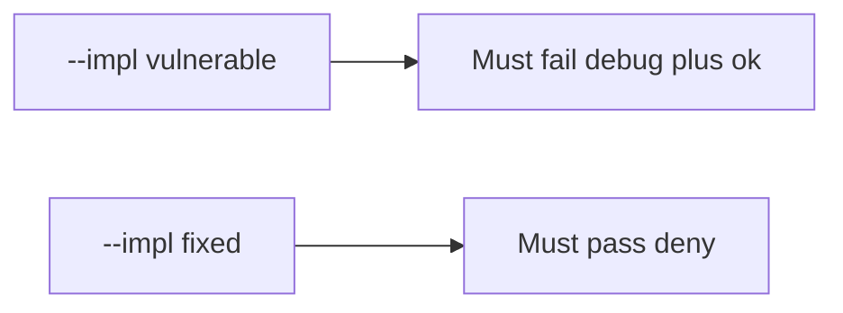

# Fail on the broken files, then pass on the repaired ones

**Kind:** verification-lab
**Loop step:** 5 Verify

## If you cannot test it, it is still a slogan

“`minifyEnabled` is true” is not evidence. “Play App Signing is on” is a tool observation. The check is: `api_allowed("debug", "ok")` is false, and `api_allowed("release", "ok")` may be true. The debug-plus-ok observation must be **false** on `--impl vulnerable` (returns true) and **true** on `--impl fixed`. Do not unpack store APKs.

## Picture: broken files must fail: debug plus ok

A check that only counts passing cases can pass while debug still calls prod. This check asks whether always-true `api_allowed` still counts as a passing control. Broken must fail that question. Repaired must pass it.



If both pass, the check is not looking at debug-to-prod. If both fail, the fix is not structural or the check is wrong.

## Three observations, even for a channel

| Mode | Must show for this topic |
|---|---|
| Wrong input / abuse | debug + ok → false; broken files must fail (`test_debug_build_cannot_call_prod_export`) |
| Normal | release + ok → true (`test_release_with_attest_may_call_prod`; may pass on both) |
| Extra | release + fail → false (`test_release_without_attest_is_denied`) |
| Not claimed | real Play Integrity; R8; live signing; hardware-backed keys |

Practice checks live in `labs/8.4/8.4-lab/tests/test_property.py`. `test_debug_build_cannot_call_prod_export` is a **what-must-not-happen** check: an always-true `api_allowed` is not allowed to count as a passing control.

```text
python3 -m pytest labs/8.4/8.4-lab/tests --impl vulnerable
python3 -m pytest labs/8.4/8.4-lab/tests --impl fixed
```

Honest release plus ok may pass on both implementations. That does not excuse the debug-deny check. If the broken files do not fail `test_debug_build_cannot_call_prod_export`, the practice is miswired — fix the wiring, not the check.

## What the checks do not prove

- Hardware-backed signing
- Resilience checks on a physical device
- That debug cannot reach a *lab* API (it should)
- Real Play Integrity token checks (8.1)
- That signing keys are absent from the repo (5.3)
- Completeness of an APK inventory list (10.2)

Record those as leftover risk or later topics, not as silent passes.

## Practice

Run both implementations this session from the lab directory if needed. Write the fail/pass pair next to the map-page row. Reject a “check” that only greps `minifyEnabled` without calling `api_allowed("debug", "ok")`. An environment error is not security evidence.

## Use it somewhere new

Clinic: a check that only asserts the debug APK builds is not this cell. Store APK unpacking is out of scope.

## What this page is not doing

Do not add a live Play trophy. Do not log signing keys. Answer keys stay out of this file.
