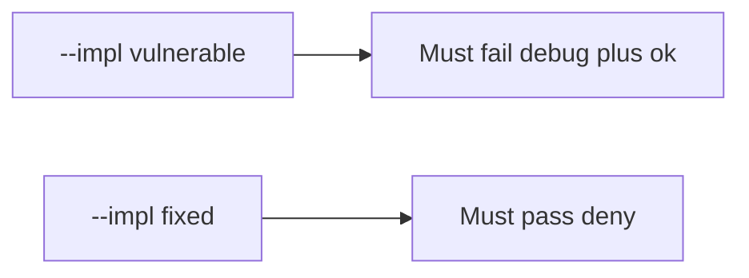

# The broken files must fail when a debug build looks ok

**Kind:** verification-lab
**Loop step:** 5 Verify

## Check it

`minifyEnabled` true does not keep the debug client id off the API. Play App Signing is a store setting. `api_allowed("debug", "ok")` has to be false, and `api_allowed("release", "ok")` may be true. On `--impl vulnerable` debug-plus-ok still returns true. On `--impl fixed` it does not. Do not unpack store APKs.

## Picture: broken files must fail: debug plus ok

A passing-test tally can still hide that debug still calls prod.



If both pass, you are not looking at debug-to-prod.

## Three things to look at

| Mode | Must show for this topic |
|---|---|
| Wrong input / abuse | debug + ok → false; broken files must fail (`test_debug_build_cannot_call_prod_export`) |
| Normal | release + ok → true (`test_release_with_attest_may_call_prod`; may pass on both) |
| Extra | release + fail → false (`test_release_without_attest_is_denied`) |
| Not claimed | real Play Integrity; R8; live signing; hardware-backed keys |

The checks are in `labs/8.4/8.4-lab/tests/test_property.py`. `test_debug_build_cannot_call_prod_export` is there so an always-true `api_allowed` still fails.

```text
python3 -m pytest labs/8.4/8.4-lab/tests --impl vulnerable
python3 -m pytest labs/8.4/8.4-lab/tests --impl fixed
```

A release build talking to prod may pass on both sides. You still have to deny a debug build calling the prod export. If the broken files do not fail `test_debug_build_cannot_call_prod_export`, the practice is miswired — fix the wiring, not the check.

## What the checks do not prove

- Hardware-backed signing
- Resilience checks on a physical device
- That debug cannot reach a *lab* API (it should)
- Real Play Integrity token checks (8.1)
- That signing keys are absent from the repo (5.3)
- Completeness of an APK inventory list (10.2)

## Practice

Do not treat a grep for `minifyEnabled` as the check. Call `api_allowed("debug", "ok")`. A setup error is not proof the rule holds.

## Use it somewhere new

Asserting the debug APK builds is not this check. Do not unpack a store APK.

## What this page is not doing

Do not treat a live Play screenshot as proof. Do not log signing keys. Answer keys are not on this site.
