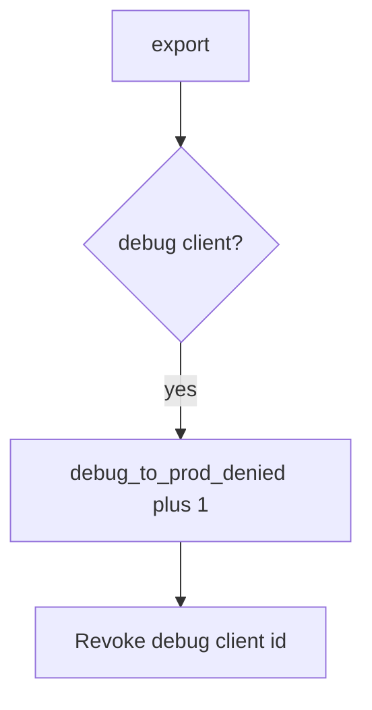

# 8.4-LO-06 — Detect debug_to_prod_denied without logging the APK

**Kind:** operations-exercise
**Loop step:** 6 Operate
**Standards:** NIST CSF 2.0 (final) DE/RS/RC as outcome labels; ASVS 5.0.0 (final) `v5.0.0-13.3.1`; MASVS 2.1.0 (final) `MASVS-CODE`. Do not use MASVS L1/L2/R.

## Prevention is not absolute

A new flavor can reuse the prod client id after `api_allowed` was “fixed once.” Pair detect and recover. Do not log binaries or secrets (5.3). Do not attach the APK to the ticket.

## Mental model: debug hitting prod is a signal



| Outcome | This module |
|---|---|
| Detect | `debug_to_prod_denied` |
| Signal | client id class, app version; never the APK |
| Recover | Keep deny; rotate keys; fix the flavor |
| Residual | Stolen release keys; attestation farms |

CSF 2.0 Detect / Respond / Recover name outcomes. They do not prove `v5.0.0-13.3.1`. An R8 product name is not the property. Re-run `test_debug_build_cannot_call_prod_export` after any client-id change; a green “minifyEnabled” tile is not that pytest. Student flavors and leaked debug APKs are other channels of the same prod API — inventory them before claiming Recover.

## Framework defaults versus the operate guarantee

A Play Console dashboard will show signing status and stay silent when FastAPI still allows `build_type=debug`. Detection must observe **debug plus ok is false**, not store health. If the alert includes signing keys or an APK, you have opened a 5.3 cell.

## Practice

Write one log line you would accept. Tie it to `labs/8.4/8.4-lab`.

```text
log_denied reason=debug_to_prod_denied client=debug request_id=req_84e
```

Reject any line that includes signing keys, an APK, or a live Play Console trace.

## Transfer

Clinic: detect debug FHIR calls on a local fixture; do not attach the APK to the ticket. Do not unpack a live clinic APK.

## Usability

Developers still need a debug build against **lab** data. Do not ship a spinner that retries prod forever when denied (WCAG 2.2 Success Criterion 4.1.3). Announce “use the lab environment.”

## Non-goals

An R8 product name is not the property. Live Play traces are out of scope. Gates 0–10 stay not-attempted.
