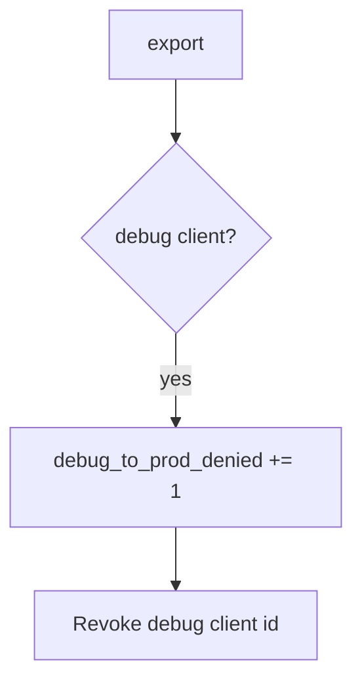

# 8.4-LO-06 — Detect debug_to_prod_denied without logging the APK

**Kind:** operations-exercise
**Loop step:** 6 Operate
**Standards:** NIST CSF 2.0 (final) DE/RS/RC as outcome labels; ASVS `v5.0.0-13.3.1`.

## Prevention is not absolute

A new flavor can reuse the prod client id. Pair detect and recover. Do not log binaries or secrets (5.3).

## Mental model: debug hitting prod is a signal



| Outcome | This module |
|---|---|
| Detect | `debug_to_prod_denied` |
| Signal | client id class, app version; never the APK |
| Recover | Keep deny; rotate keys; fix the flavor |
| Residual | Stolen release keys; attestation farms |

## Practice

Write one log line you would accept. Tie it to `labs/8.4/8.4-lab`.

```
log_denied reason=debug_to_prod_denied client=debug request_id=req_84e
```

Reject any line that includes signing keys, an APK, or a live Play Console trace.

## Transfer

Clinic: detect debug FHIR calls; do not attach the APK to the ticket.

## Non-goals

An R8 product name is not the property.
