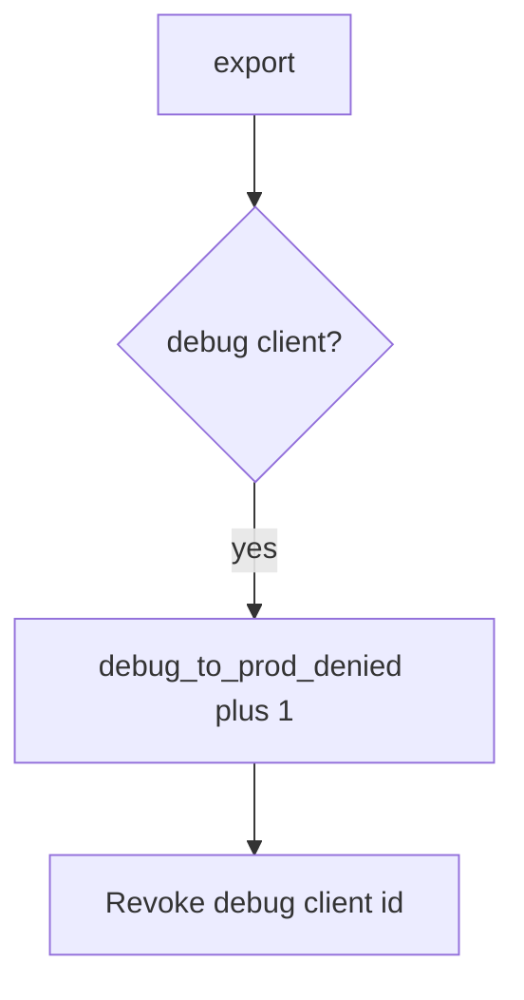

# Log the deny, not the APK

**Kind:** operations-exercise
**Loop step:** 6 Operate

## Fixing it once is not enough

A debug flavor can reuse the prod client id. Do not attach binaries, secrets, or the APK.

## Picture: debug hitting prod is a signal



A dashboard tile does not prove secrets stayed out of the APK.

## Signals that do not become a second leak

| Outcome | This topic |
|---|---|
| Notice | `debug_to_prod_denied` |
| What the line holds | client id class, app version, request id; never the APK |
| Recover | Keep deny; rotate keys; fix the flavor |
| Leftover | Stolen release keys; attestation farms |

Minify does not keep a debug build off prod export. A debug build still has to fail `test_debug_build_cannot_call_prod_export`. `minifyEnabled` is shrink, not a channel split. Student flavors and leaked debug APKs still hit the same prod API; the client id is not private until those channels are named.

## What the framework does vs what you still have to check

A Play Console dashboard will show signing status and stay silent when FastAPI still allows `build_type=debug`. Notice must observe **debug plus ok is false**, not store health. If the alert includes signing keys or an APK, you have opened a leftover hole from topic 5.3.

Debug-to-prod denials fire without the APK.

## Practice

```text
log_denied reason=debug_to_prod_denied client=debug request_id=req_84e
```

Reject any line that includes signing keys, an APK, or a live Play Console trace.

## Use it somewhere new

Notice debug FHIR calls on a local helper; do not attach the APK to the ticket. Do not unpack a live clinic APK.

## Can people still use it

Developers still need a debug build against **lab** data. Do not ship a spinner that retries prod forever when denied. Announce “use the lab environment.”

## What this page is not doing

An R8 screenshot does not finish this page. Do not use live Play traces. Opening this page does not finish a check-in.
