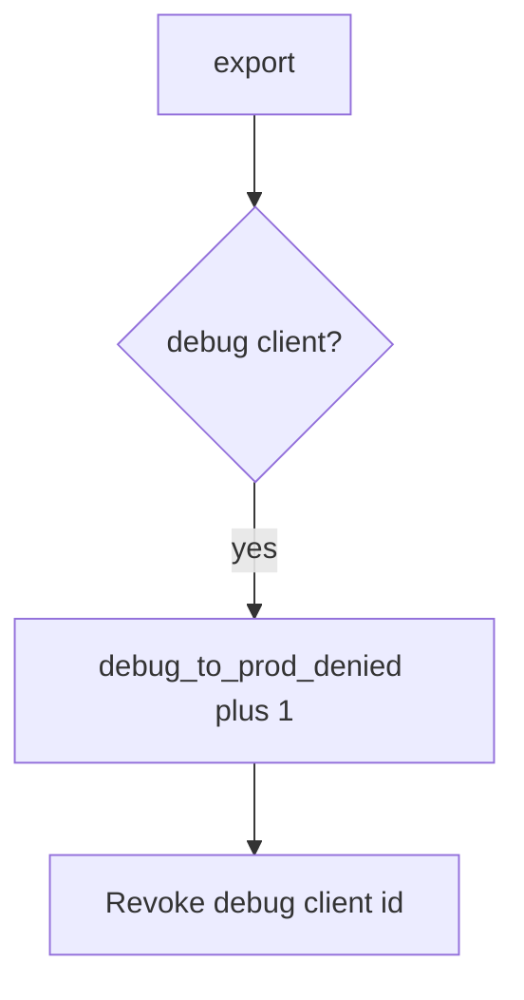

# Log the deny, not the APK

**Kind:** operations-exercise
**Loop step:** 6 Operate

## Stopping it is not enough

A new flavor can reuse the prod client id after `api_allowed` was “fixed once.” Pair notice and recover. Do not log binaries or secrets (5.3). Do not attach the APK to the ticket.

## Picture: debug hitting prod is a signal



Industry lists talk about noticing, responding, and recovering. They do not prove secrets stayed out of the APK. Someone still has to own the leftover flavor.

## Signals that do not become a second leak

| Outcome | This topic |
|---|---|
| Notice | `debug_to_prod_denied` |
| What the line holds | client id class, app version, request id; never the APK |
| Recover | Keep deny; rotate keys; fix the flavor |
| Leftover | Stolen release keys; attestation farms |

Naming an R8 product is not the rule. Re-run `test_debug_build_cannot_call_prod_export` after any client-id change; a green “minifyEnabled” tile is not that check. Student flavors and leaked debug APKs are other channels of the same prod API — list them before you claim Recover.

## What the framework does vs what you still have to check

A Play Console dashboard will show signing status and stay silent when FastAPI still allows `build_type=debug`. Notice must observe **debug plus ok is false**, not store health. If the alert includes signing keys or an APK, you have opened a leftover hole from topic 5.3.

What this practice is supposed to show: debug-to-prod denials fire without the APK. Naming a product is not the rule.

## Practice

Write one log line you would accept in review. Tie it to `labs/8.4/8.4-lab`. Example shape (fake ids only):

```text
log_denied reason=debug_to_prod_denied client=debug request_id=req_84e
```

Reject any line that includes signing keys, an APK, or a live Play Console trace.

## Use it somewhere new

A clinic example: notice debug FHIR calls on a local helper; do not attach the APK to the ticket. Do not unpack a live clinic APK.

## Can people still use it

Developers still need a debug build against **lab** data. Do not ship a spinner that retries prod forever when denied. Announce “use the lab environment.”

## What this page is not doing

Naming an R8 product is not the rule. Live Play traces are out of scope. Opening this page does not finish a check-in.
