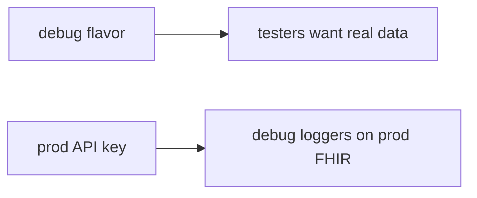

# 8.4-LO-07 — Transfer: clinic debug build against prod FHIR

**Kind:** transfer-challenge
**Loop step:** 7 Transfer
**Standards:** OWASP MASVS 2.1.0 (final) `MASVS-CODE`. Resilience as cost. ASVS `v5.0.0-13.3.1`.

## Change the workplace; keep debug off production

Do not answer with a Top 10 / CWE / scanner as the definition of security.

**Prompt:** Clinic debug build against prod FHIR. Also name APK SBOM (10.2).

**Product sketch:** EHR-lite “debug flavor uses the same ApplicationId and API key so testers can hit real data,” plus R8 on release.

Rewrite the SecureCollab sentence. Include:

1. attacker capabilities (leaked debug APK — not a live hospital);
2. trust assumptions (server build+attest is TCB; R8 and Play App Signing are not);
3. forbidden outcome (`api_allowed("debug","ok")` true, not “HIPAA”);
4. a test idea on a **local** fixture only (no store APK unpacking);
5. residual (stolen release keys, attestation farms, 8.1 hostile release APK);
6. WCAG if a human deny path exists (readable “use the lab environment”).

## Mental model: same key, two flavors

## What graders reject

| Reject | Why |
|---|---|
| “R8 is on” | Cost, not channel |
| Live Play Console / unpacking | Lab policy |
| “MASVS R-level” | Obsolete MASVS levels; profiles live in MASTG |

## Practice

One page. No keys. `labs/8.4/8.4-lab` is the only running system you may break.
