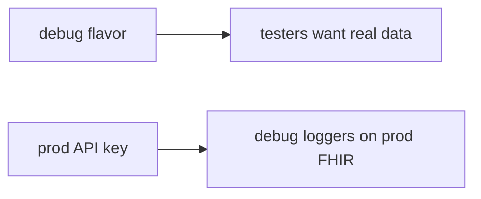

# Same idea on a clinic debug build talking to prod FHIR

**Kind:** transfer-challenge
**Loop step:** 7 Transfer

## Use it somewhere new

You get a clinic debug build against prod FHIR. Also name an APK inventory list (10.2).

On the notes app, `api_allowed("debug", "ok")` must be false.

**Product sketch:** an EHR-lite “debug flavor uses the same application id and API key so testers can hit real data,” plus R8 on release.

## Picture: same key, two flavors

If testers share the prod API key while `api_allowed` is always true, the rule is gone. R8, Play App Signing, and root detection do not check `build_type`. An APK inventory list (10.2) is a list of what shipped, not this channel check — name it, do not unpack store APKs here. Debug should still reach a **lab** FHIR sandbox.

| Notes app this week | Clinic sketch |
|---|---|
| Leaked debug APK or student flavor | Clinic debug flavor — not a live hospital |
| `api_allowed("debug", "ok")` | Same helper idea on a local FHIR stand-in |
| Server build-plus-attest is what you trust | Same; R8 and Play App Signing are not |
| APK inventory leftover (10.2) | Name the list; do not unpack a store APK here |

## Write this for a clinic debug vs prod FHIR

1. who can act (leaked debug APK — not a live hospital);
2. what you trust (server build-plus-attest is what you trust; R8 and Play App Signing are not);
3. what must not happen (`api_allowed("debug","ok")` true, not “HIPAA”);
4. a check idea on **local** practice files only (no store APK unpacking);
5. leftover risk (stolen release keys, attestation farms, 8.1 hostile release APK);
6. the web accessibility baseline if a human deny path is in the claim (readable “use the lab environment,” not a spinner that retries prod forever).

Debug plus ok still has to be false. Release plus ok may still be true. Turning on R8 and Play App Signing without a debug-to-prod deny check leaves `api_allowed("debug","ok")` true. The local check is `test_debug_build_cannot_call_prod_export` — on the practice files, not a store APK unpack.

## What is not good enough

| Reject | Why |
|---|---|
| “R8 is on” | Cost, not channel |
| Live Play Console / unpacking | Course rules |
| “mobile-app R-level” | Obsolete labels; resilience lives in testing profiles |
| Play App Signing as this rule | Store signing, not debug deny |
| Debug APK builds as evidence | Wrong observation |

## Practice

One page. No keys. `labs/8.4/8.4-lab` is the only running system you may break. Do not unpack a public APK.

## What this page is not doing

Do not try live-target reverse engineering. Do not use real FHIR keys. This page does not finish a check-in.
