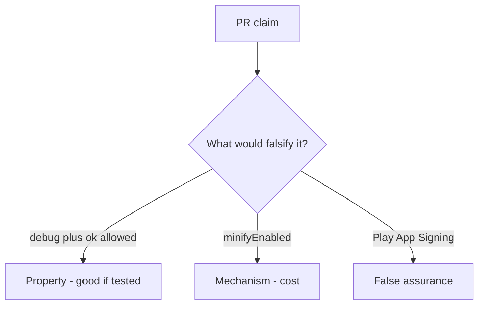

# 8.4-LO-08 — Review always-true api_allowed as a PR, not an R8 sticker

**Kind:** code-review
**Loop step:** Review
**Standards:** OWASP MASVS 2.1.0 (final) `MASVS-CODE`.

## Review the fixture as if it were SecureCollab prod export gating

Review `labs/8.4/8.4-lab/vulnerable/` as a SecureCollab PR. Intended findings live only in `content/assessment/keys/8.4.md` — not here.

## Mental model: property, mechanism, or false assurance

Seeded smells (label them yourself; do not open the keys file):

- `api_allowed` debug+ok true
- Signing key in the repo
- Same API key in debug and release (5.3)
- Resilience checklist as Gate 8 evidence

Also reject: live store reverse engineering, keys in lessons, MASVS L1/L2/R as current.

## Misconceptions

- Obfuscation equals security
- Play App Signing means we do not care
- Anti-debug proves the server can trust the client

## Practice

Write three review notes. Tie at least one to `test_debug_build_cannot_call_prod_export`.

## Transfer

Clinic PR that “enabled R8 and Play App Signing” without a debug-to-prod deny test is incomplete.
