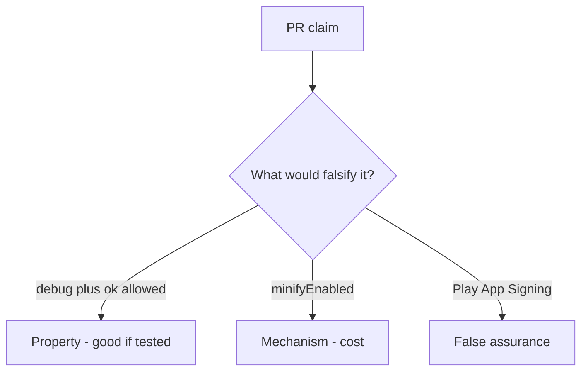

# 8.4-LO-08 — Review always-true api_allowed as a PR, not an R8 sticker

**Kind:** code-review
**Loop step:** Review
**Standards:** OWASP MASVS 2.1.0 (final) `MASVS-CODE`. Do not use MASVS L1/L2/R.

## Review the fixture as if it were SecureCollab prod export gating

Review `labs/8.4/8.4-lab/vulnerable/` as a SecureCollab PR. Your job is not to count suspicious lines. Reconstruct whether `api_allowed("debug", "ok")` still returns true, compare that with the module invariant, and write changes a developer can verify.

Intended findings live only in `content/assessment/keys/8.4.md` — not here. Do not open the keys file until your review has been evaluated.

## Mental model: api_allowed debug+ok true

Start with this seeded smell: **`api_allowed` debug+ok true**. Label it property, mechanism, or false assurance before you accept the PR.

Classification starts at the protected effect (debug plus ok denied). Everything that is not a server `release` and attest check at that call is a candidate debug-to-prod path. An R8 screenshot without that pytest is the same smell, not a different finding class.

Signing keys in the repo (5.3) and the same API key in debug and release are other CODE holes — name them, do not skip `test_debug_build_cannot_call_prod_export`. Resilience checklists raise cost; they do not become Gate 8 evidence.

## Seeded smells (label them yourself)

- `api_allowed` debug+ok true
- Signing key in the repo
- Same API key in debug and release (5.3)
- Resilience checklist as Gate 8 evidence

Also reject: live store reverse engineering; closing findings without re-running `test_debug_build_cannot_call_prod_export`; keys in lessons; MASVS L1/L2/R as current.

## Misconceptions this module refuses

- Obfuscation equals security
- Play App Signing means we do not care
- Anti-debug proves the server can trust the client
- MASVS R-level is a current MASVS level
- minifyEnabled is this cell

## Practice

Write three review notes a maintainer could act on. Each note: observation, property or false assurance, suggested structural change, residual you will **not** delete. Tie at least one to `test_debug_build_cannot_call_prod_export`.

## Transfer

Clinic PR that “enabled R8 and Play App Signing” without a debug-to-prod deny test is an incomplete channel review. Name the independent falsehood that would still keep debug plus ok false.

## Non-goals

Do not merge by adding a comment “will split flavors later.” That comment is a residual without an owner. Do not unpack a store APK to prove the finding.
