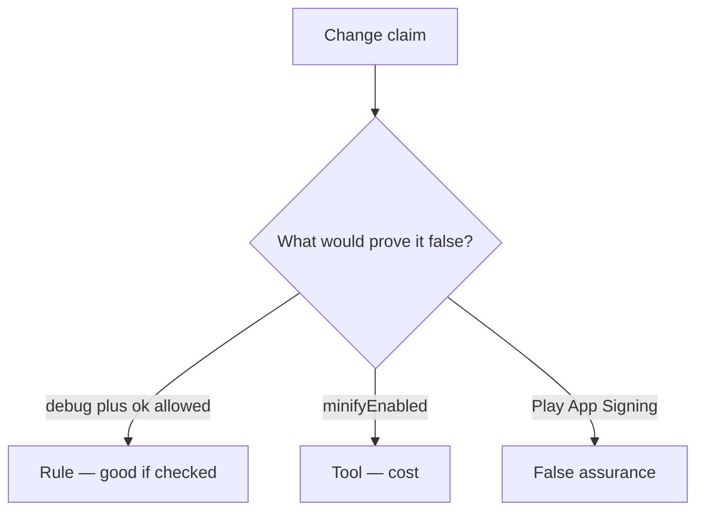

# Would you merge this always-true api_allowed?

**Kind:** code-review
**Loop step:** Review

Wait until someone has looked at your review before opening the keys.

## What you are reviewing

Review `labs/8.4/8.4-lab/vulnerable/` as a change to the notes app’s prod export gating. Check whether `api_allowed("debug", "ok")` still returns true.

The check you already ran (`test_debug_build_cannot_call_prod_export`) is the rule check. A comment “we should split flavors later” is not. An R8 screenshot is not this review.

## Picture: api_allowed debug+ok true

**`api_allowed` debug+ok true**.

Debug plus ok still has to be denied. If the change never checks a server `release` and attest, that debug-to-prod path is still open. An R8 screenshot without that check is still the same problem.

Signing keys in the repo (5.3) and the same API key in debug and release are other leftover holes — name them, do not skip `test_debug_build_cannot_call_prod_export`. Resilience checklists raise cost; they do not become Gate 8 evidence.

## Problems to find (name them yourself)

- `api_allowed` debug+ok true
- Signing key in the repo
- Same API key in debug and release (5.3)
- Resilience checklist as Gate 8 evidence

Also reject: live store reverse engineering; closing findings without re-running `test_debug_build_cannot_call_prod_export`; keys in learner notes; old mobile-app L1/L2/R labels as current.

## Common mix-ups this topic refuses

- Obfuscation equals security
- Play App Signing means we do not care
- Anti-debug proves the server can trust the client
- Mobile-app “R-level” is a current verification level
- `minifyEnabled` is this rule

## Practice

Write three notes a peer could act on, and tie at least one to `test_debug_build_cannot_call_prod_export`. For each: what you saw, whether it is a rule or false assurance, a structural change, leftover you will **not** delete.

## Use it somewhere new

A clinic change that “enabled R8 and Play App Signing” without a debug-to-prod deny check is an incomplete channel review. Name the independent falsehood that would still keep debug plus ok false.

## What this page is not doing

Do not merge by adding a comment “will split flavors later.” That comment is leftover without an owner. Do not unpack a store APK to prove the finding.
