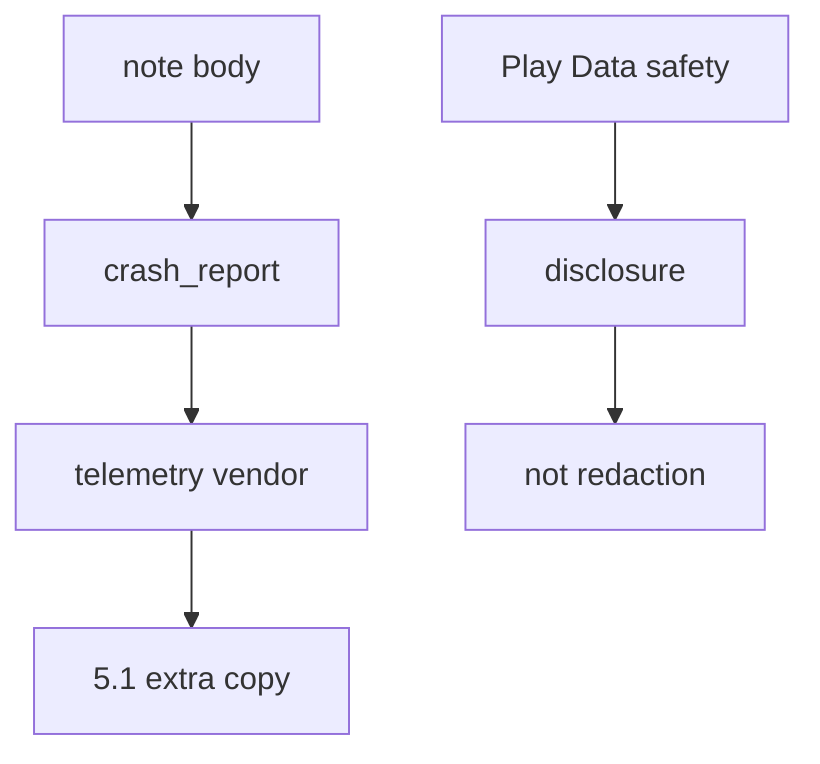
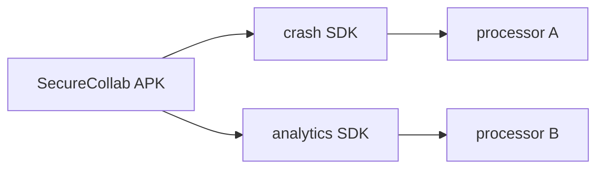

# 8.5-LO-01 — A crash report must not include the note body

**Kind:** concept-model
**Loop step:** 1 Property
**Standards:** OWASP MASVS 2.1.0 (final) `MASVS-PRIVACY-1`–`PRIVACY-4`. ASVS `v5.0.0-16.2.5`; `v5.0.0-16.5.4` is **Level 3, advanced**. MASTG 2.0.0 testing profiles — not MASVS L1/L2/R. Mobile Top 10:2024 awareness after the cause.

## The claim this module owns

SecureCollab Android may crash while a member is viewing a note. The **note body is a 1.1 privacy cell**. A crash report that includes that body ships the cell to a telemetry vendor (3.1 / 5.1). Play Data safety is a **disclosure form**, not redaction.

> `crash_report("secret")` must not contain `secret`. A stack identifier may remain.

The forbidden outcome is **crash JSON contains the note body**. That is confidentiality of bodies in telemetry — a vendor copy, and maybe a public bucket if the vendor is misconfigured.

MASVS-PRIVACY-1 wants minimized access (do not collect the body). PRIVACY-3 wants transparency about what *is* collected; filling the Play form does not delete the field. PRIVACY-2 / PRIVACY-4 are unlinkability and user control — they do not make an unredacted dump safe. MAS Testing Profiles live in **MASTG**, not a current MASVS “L1.”

## Mental model: telemetry is a sink



## Mental model: tracker SDK is another processor



**Mechanism (not the property):** Firebase Crashlytics “automatic,” a Play Data safety checkbox, or “we use HTTPS to the vendor.”

## Root cause vs impact vs prevention vs detection vs recovery

| Slice | For this property |
|---|---|
| Root cause | Exception / report builder includes the note body |
| Preconditions | `secret` in `str(report)` |
| Trigger | Crash on view-note, or verbose logcat |
| Impact | Body at a vendor; maybe public if misbucketed |
| Prevention | Do not put bodies in exceptions; redact before send; permission minimization |
| Detection | `crash_body_redacted`; CI grep of crash fixtures |
| Recovery | Purge vendor; notify if the copy left the TCB |

## Framework defaults versus the privacy guarantee

A crash SDK will ship whatever you attach. Android private storage (8.2) does not encrypt the HTTPS payload. `v5.0.0-16.2.5` is the same protection-level rule as 3.1, now at a mobile sink.

## Mechanism limits

- Screenshots in “send feedback.”
- ANR traces and logcat if a leftover `READ_LOGS` path prints the body.
- Vendor as processor — contract + 5.1, not disappearance.
- Last-resort handlers (`v5.0.0-16.5.4`, Level 3) can still dump frames that embed arguments.

## Usability and accessibility

In-app “send feedback” must not require attaching a screenshot of the note to proceed (WCAG 2.2 4.1.3). Offer a text field that is itself redacted before send.

## Practice

Where does a crash go; who is the processor. Then run:

```
python3 -m pytest labs/8.5/8.5-lab/tests --impl vulnerable
python3 -m pytest labs/8.5/8.5-lab/tests --impl fixed
```

The first command must fail. The second must pass.

## Transfer

Clinic crash with a synthetic patient name. Web Sentry (10.5) same cell.

## Non-goals

Live Crashlytics, Play Console, public APKs, real PII. Gates 0–10 and M0–M5 stay **not-attempted**. Answer keys are not in this file.
