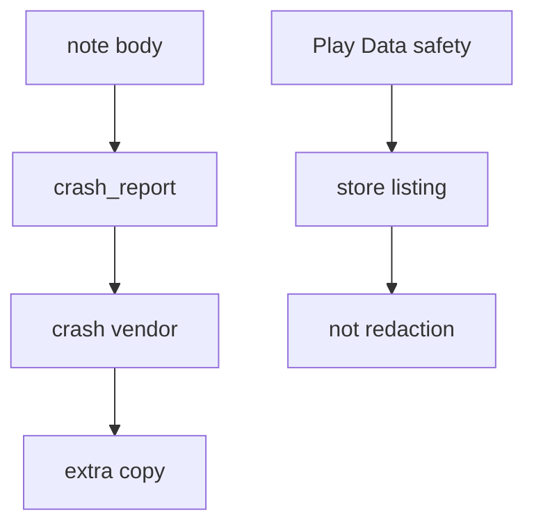
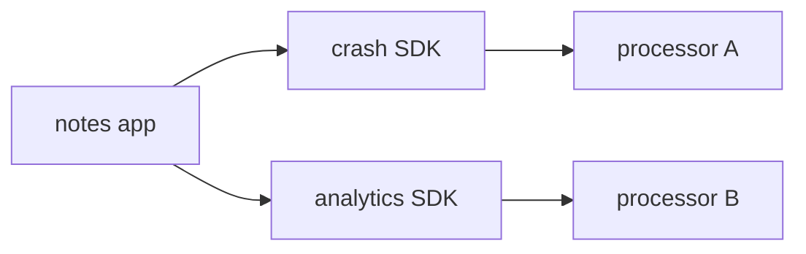

# A crash report must not include the note body

**Kind:** concept-model
**Loop step:** 1 Property

## The rule

The notes app on a phone can crash while someone is looking at a note. The note body is still confidential. A crash report is another place that field can land.

If the report includes the body, you have shipped the note to a crash vendor. That is an extra copy, the same kind of leftover as a log line (3.1) or a vendor who keeps data (5.1). The store’s privacy form is a **disclosure**. It does not strip the field.

> `crash_report("secret")` must not contain `secret`. A stack identifier may stay. The form you fill in the store does not enforce this.

So what must not happen: **crash JSON contains the note body**. That is secrecy of bodies in telemetry. The vendor has a copy. If their bucket is open, other people might too.

Privacy lists ask you to collect less (do not put the body in the report) and to say what you *do* collect. Filling the store form does not delete the field. Unlinkability and “the user can delete their account” do not make an unredacted dump safe.

## Picture: telemetry is a place the field can land



## Picture: a crash SDK is another processor



**A tool, not the rule:** a crash product set to “automatic,” a checkbox on the store listing, or “we use HTTPS to the vendor.”

## People who can read a crash report

| Person | What they can do here | Motive | Harm if the body is in the report |
|---|---|---|---|
| Crash-platform operator | Read crash JSON | Debug the crash | Reads the note body |
| Logcat reader | Read device logs | Debug on a phone | Same body, now in a log |
| Analytics vendor | Index extras the tracker SDK shipped | Run the product | Same body, second vendor |
| Support | Paste “what the user saw” so they can reproduce | Close a ticket | The body leaves the device and lands in a ticket |

You do not need a nation-state this week. Those four already get the body.

## Why it happens, what it costs, how you stop it, how you notice, how you recover

Someone put the note body into the exception or the report builder. That is the cause. The person who later reads the vendor dashboard is a **result**, not the cause.

| Slice | For this rule |
|---|---|
| Why it happens | The exception or report builder includes the note body |
| What has to be true first | `secret` is in `str(report)` |
| Trigger | Crash on view-note, or a verbose logcat line |
| What it costs | The body sits at a vendor; maybe public if their store is misconfigured |
| How you stop it | Do not put bodies in exceptions; redact before send; ask for fewer permissions |
| How you notice | `crash_body_redacted`; a CI check of crash practice files |
| How you recover | Purge the vendor copy; tell people if the copy left what you trust |

## What the framework does vs what you still have to check

A crash SDK will ship whatever you attach. Private storage on the phone (8.2) does not encrypt the HTTPS payload. The same protection-level rule as the log lesson (3.1) now applies at this mobile place.

What this practice is supposed to show: `crash_report("secret")` does not contain `secret`. Practice files are in `labs/8.5/8.5-lab`. Fake data only. No live crash product. No real people's notes.

## What the tool cannot do

- Screenshots in “send feedback.”
- Frozen-app traces and logcat if a leftover `READ_LOGS` path still prints the body.
- The vendor as a processor — a contract plus the extra-copy lesson (5.1), not disappearance.
- Last-chance error handlers that dump every frame, including function arguments. That is an advanced extra, not this week's check.

## Can people still use it

In-app “send feedback” must not require attaching a screenshot of the note to continue. Offer a text field. Redact that field before send. Do not encode “this is sensitive” as color only.

## Practice

Where does a crash go, and who is the processor? Then run the local pair:

```text
python3 -m pytest labs/8.5/8.5-lab/tests --impl vulnerable
python3 -m pytest labs/8.5/8.5-lab/tests --impl fixed
```

## Use it somewhere new

Clinic crash with a fake patient name. Web crash reports (10.5) are the same field in another place.

## What this page is not doing

Do not use live crash consoles, the public store, public apps, and real people's data. Answer keys are not on this site.
