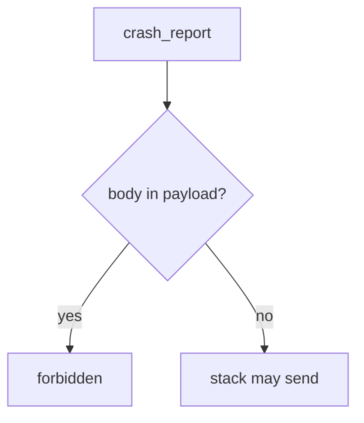
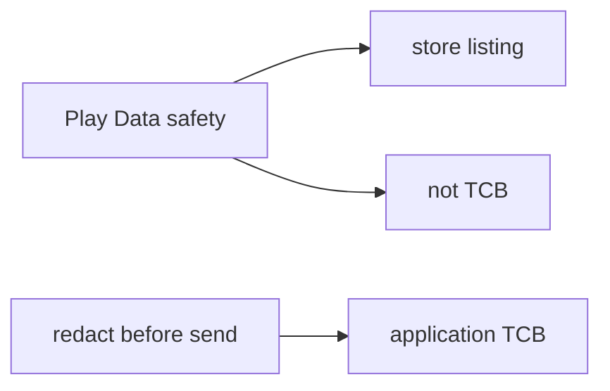

# 8.5-LO-02 — Telemetry is a 3.1 and 5.1 sink

**Kind:** design-exercise
**Loop step:** 2 Model
**Standards:** OWASP MASVS 2.1.0 (final) `MASVS-PRIVACY-1`, `MASVS-PRIVACY-3`. ASVS `v5.0.0-16.2.5`.

## Can a second engineer name pytest cases from your sink map?

“We filled in Play Data safety” is not this lesson. A reviewable model names **what may leave the device, to whom, and which field is forbidden**.

SecureCollab Phase 8 freeze: local `crash_report(note_body)`. No live vendors.

## Mental model: body vs stack

## Mental model: disclosure is not the TCB

MASVS-PRIVACY-3 (transparency) is the label. MASVS-PRIVACY-1 (minimize) is the redaction. Mixing them is how a form becomes false assurance.

## Step 1: freeze pieces

| Piece | This system |
|---|---|
| Subjects | crash SDK; tracker SDK; logcat reader |
| Objects | stack trace; note body |
| Actions | `crash_report` |
| Channels | HTTPS to vendor; logcat |
| TCB | redaction before send |
| Untrusted | third-party SDK; verbose logging; Play form |
| State / time | crash at view-note |
| 1.1 cell | confidentiality of bodies in telemetry |

## Step 2: write cells

| Subject | Object | Action | Decision |
|---|---|---|---|
| SDK | body | send | deny |
| SDK | stack | send | allow |
| logcat | body | print | deny |
| vendor | retained copy | 5.1 | contract + purge |

## Practice

Draw the map. Point at `labs/8.5/8.5-lab` file `crash.py`.

## Transfer

Web Sentry (10.5): same body-vs-stack split.

## Residual risk

Vendor as processor; screenshots; ANR; leftover `READ_LOGS`.

## Non-goals

Top 10 as the definition of security. Keys stay out of lessons.
