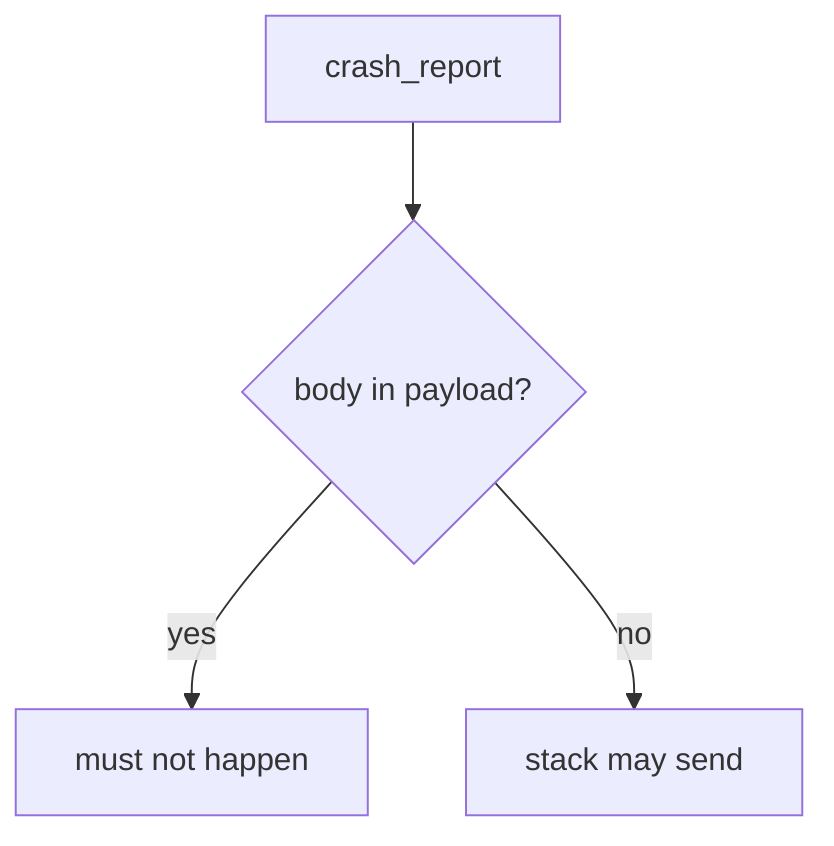
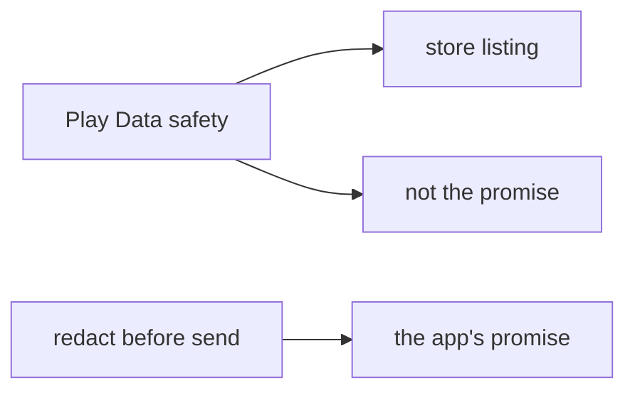

# Telemetry is another place the field can land

**Kind:** design-exercise
**Loop step:** 2 Model

## Could someone else name the checks?

“We filled in the store’s privacy form” is not this lesson. A drawing someone else can test names **what may leave the device, to whom, and which field is forbidden**.

This week's freeze for the notes app: local `crash_report(note_body)`. No live vendors.

> For the note body at `crash_report`, the rule is deny. A stack identifier may send. Evidence that the deny is false: `'secret'` in `str(crash_report("secret"))`.

If the body × crash-report row is blank, the field appears in telemetry because nobody named the place.

## Picture: body vs stack

## Picture: a store listing is not the app's promise

Transparency is the label. Collecting less is the redaction. Mixing them is how a form becomes false comfort.

## Step 1: name the pieces

Do not invent a new catalogue. Take the fields you already have and ask where each one may land.

| Piece | This system |
|---|---|
| Who | Crash SDK; tracker SDK; logcat reader |
| What | Stack trace; note body |
| Actions | `crash_report` |
| Paths | HTTPS to the vendor; logcat |
| What you trust for this journey | Redaction before send |
| What you do not trust | A third-party SDK; verbose logging; the store form |
| Time | Crash at view-note |
| The rule | Secrecy of bodies in telemetry |

## Step 2: write allow and deny

| Who | What | Action | Decision |
|---|---|---|---|
| SDK | body | send | deny |
| SDK | stack | send | allow |
| logcat | body | print | deny |
| vendor | retained copy | keep | contract plus purge (5.1) |

A missing body×crash row is how the body shows up as “debug extras.” Write the hole.

## Practice

Draw the map so someone else could name the checks. Point at `labs/8.5/8.5-lab` file `crash.py`.

## Use it somewhere new

Web crash reports (10.5): same body-vs-stack split.

## What can still go wrong

The vendor as a processor. Screenshots. Frozen-app traces. A leftover `READ_LOGS` path.

## What this page is not doing

Do not define security as a famous-bugs list. Answer keys are not on this site.
