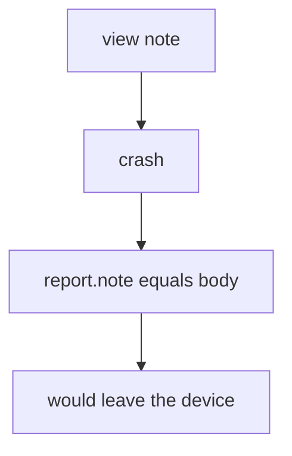

# 8.5-LO-03 — Observe the body in crash JSON, do not call a vendor

**Kind:** mechanism-lab
**Loop step:** 3 Break
**Standards:** OWASP MASVS 2.1.0 (final) `MASVS-PRIVACY-1`. ASVS 5.0.0 (final) `v5.0.0-16.2.5`. `v5.0.0-16.5.4` last-resort handlers are **Level 3, advanced**. PRIVACY-3 (Play Data safety) is disclosure, not this oracle. Do not use MASVS L1/L2/R.

## Authorized scope

`labs/8.5/8.5-lab` only. The fixture is an in-process `crash_report(note_body)`. Synthetic note string `secret`. No live Crashlytics, Play Console, Sentry, or public apps. Do not send the JSON anywhere.

**Forbidden outcome:** Crash report contains the note body. `'secret' in str(crash_report("secret"))` is true.

Attacker capability in this lab: a crash-platform operator or a logcat reader. That stands in for a clinic “debug crash includes the last chart so support can reproduce,” a tracker SDK extra, or a leftover `READ_LOGS` path. Trust assumption: `crash_report` is supposed to be a **redact-before-send** sink (3.1 / 5.1 at mobile grain). Crashlytics “automatic,” a completed Play Data safety form, and HTTPS to the vendor are not in the TCB for this cell.

## Mental model: exception includes the body



The vulnerable tree demonstrates **cause** (report builder copies the body). Do not send the JSON anywhere. Preconditions: `crash_report` returns a dict with `'note': note_body`. You do not need an emulator. You must not call a crash vendor.

MASVS-PRIVACY-1 wants minimized access (do not collect the body). Module 3.1 already refused bodies in logs; this cell is **the mobile telemetry sink**. Play Data safety discloses; it does not redact.

## What to read in the fixture

`vulnerable/crash.py` returns a dict with `'note': note_body`. Tests:

- `test_crash_report_omits_note_body`
- `test_honest_crash_still_includes_stack` — a stack identifier may remain

You do not need a new field name. The failure of `test_crash_report_omits_note_body` *is* the evidence.

Do not open the fixed tree yet. Diagnose the cause first.

## Root cause vs impact vs prevention vs detection vs recovery

| Slice | This lab |
|---|---|
| Required property | `'secret' not in str(crash_report("secret"))` |
| Root cause | Exception / report builder includes the note body |
| Preconditions | `note` key holds the body |
| Trigger | Crash on view-note, or verbose logcat |
| Impact | Body at a vendor; maybe public if misbucketed (5.1 extra copy) |
| Prevention | Do not put bodies in exceptions; redact before send |
| Detection | `crash_body_redacted`; CI grep of crash fixtures; never the body |
| Recovery | Keep redact; purge vendor; notify if the copy left the TCB |
| Not the lesson | A Crashlytics product name; live vendor; Play Data safety as redaction |

## Framework defaults versus the privacy guarantee

A crash SDK will ship whatever you attach. Android private storage (8.2) does not encrypt the HTTPS payload. FastAPI Sentry (10.5) is the same cell on the web. The application guarantee is: **this** fixture, `'secret'` is absent from the report.

## Practice

```text
python3 -m pytest labs/8.5/8.5-lab/tests --impl vulnerable
```

Run from `labs/8.5/8.5-lab` if a repo-root collection picks up `site/`. Record `test_crash_report_omits_note_body`. Do not probe public hosts. An environment error is not security evidence.

## Transfer

Clinic: predict a crash that includes a synthetic patient name — still only this directory. Do not call live Crashlytics.

## Non-goals

No live-target or payload-dump instructions. Synthetic `'secret'` only. Do not dump real PII into fixtures.
