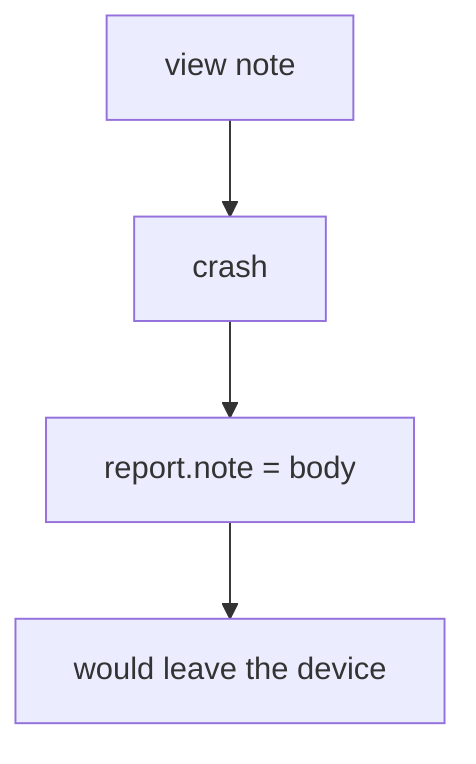

# 8.5-LO-03 — Observe the body in crash JSON, do not call a vendor

**Kind:** mechanism-lab
**Loop step:** 3 Break
**Standards:** OWASP MASVS 2.1.0 (final) `MASVS-PRIVACY-1`. ASVS `v5.0.0-16.2.5`.

## Authorized scope

`labs/8.5/8.5-lab` only. Synthetic note string `secret`. No live Crashlytics, Play Console, or public apps.

**Forbidden outcome:** Crash report contains the note body.

## Mental model: exception includes the body



The vulnerable tree demonstrates **cause** (report builder copies the body). Do not send the JSON anywhere.

## What to read in the fixture

`vulnerable/crash.py` returns a dict with `'note': note_body`. Tests require `'secret' not in str(rep)`.

## Root cause vs impact

| Slice | Lab |
|---|---|
| Root cause | Report includes the body |
| Impact | Body would be at a vendor |
| Not the lesson | A Crashlytics product name as the definition |

## Practice

```
python3 -m pytest labs/8.5/8.5-lab/tests --impl vulnerable
```

Record `test_crash_report_omits_note_body`. Do not probe public hosts.

## Transfer

Clinic: predict a crash that includes a synthetic patient name — still only this directory.

## Non-goals

No live-target or payload-dump instructions.
