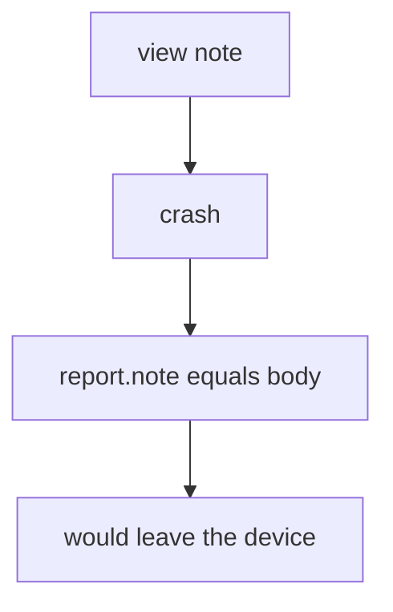

# Practice: crash JSON contains the note body

**Kind:** mechanism-lab
**Loop step:** 3 Break

## Try it

The practice is not a website you attack. `crash_report` returns a dict: it copies the note body into the report, so the JSON already holds the secret.

> A confidential note body must not appear in this crash report. If `crash_report("secret")` includes `secret`, telemetry has failed as a security control.

## Where you may practice

Stay inside `labs/8.5/8.5-lab`. The body is the synthetic string `secret`. No live crash consoles, no public store, no public apps. Do not send the JSON anywhere.

Do not paste a real note body into a crash SDK “to see what happens.” Do not paste this exercise onto a public crash project, employer dashboard, or live clinic.

`crash_report` is supposed to redact before send — the same extra-copy problem as logs (3.1) and vendors (5.1), now on a phone. A crash product set to “automatic,” a completed store privacy form, and HTTPS to the vendor are not enough.

Picture a crash-platform operator or a logcat reader — a clinic “debug crash includes the last chart so support can reproduce,” a tracker SDK extra, or a leftover `READ_LOGS` path.

## Picture: the report copies the body



You do not need an emulator. You must not call a crash vendor. The substring in the returned dict is already the leak.

The log lesson (3.1) already refused bodies in logs. This check is **the mobile telemetry place**. The store form discloses. It does not redact.

## What to look at: the cause, not a hunt

`vulnerable/crash.py` returns a dict with `'note': note_body`. Tests:

- `test_crash_report_omits_note_body`
- `test_honest_crash_still_includes_stack` — a stack identifier may remain


| What you see | What kind of failure | Not the lesson |
|---|---|---|
| `'note': note_body` in the dict | Confidential field in a lower-trust store | “Crashes stay on the device” |
| `'secret'` in `str(report)` | Debug extras used as the payload | A store privacy form |
| No redaction marker | The sink accepted the field | “We use HTTPS to the vendor” |

## Why it happens vs what it costs

| Slice | Practice |
|---|---|
| The rule | `'secret' not in str(crash_report("secret"))` |
| Why it happens | The exception or report builder includes the note body |
| What's already wrong | The `note` key holds the body |
| Trigger | Crash on view-note, or verbose logcat |
| What it costs | The body sits at a vendor; maybe public if their store is misconfigured (5.1 extra copy) |
| How you stop it later | Do not put bodies in exceptions; redact before send |
| How you notice later | `crash_body_redacted`; a CI check of crash practice files; never the body |
| How you recover later | Keep the redact; purge the vendor; tell people if the copy left what you trust |
| Out of scope | A crash product name, a live vendor, or the store form as redaction |

A crash SDK will ship whatever you attach. Private storage on the phone (8.2) does not encrypt the HTTPS payload. A web crash product (10.5) is the same field on the server. `'secret'` is absent from the report.

## Practice

```text
python3 -m pytest labs/8.5/8.5-lab/tests --impl vulnerable
```

Run from `labs/8.5/8.5-lab` if a collection at the repo root picks up `site/`. Do not probe public hosts. A setup error is not proof the rule holds.

## Use it somewhere new

A clinic example: predict a crash that includes a fake patient name — still only this directory. Do not call a live crash product.

## What this page is not doing

No live-target steps. Fake `'secret'` only. Do not dump real people's data into the practice files. Do not “fix” the practice by deleting the test.
