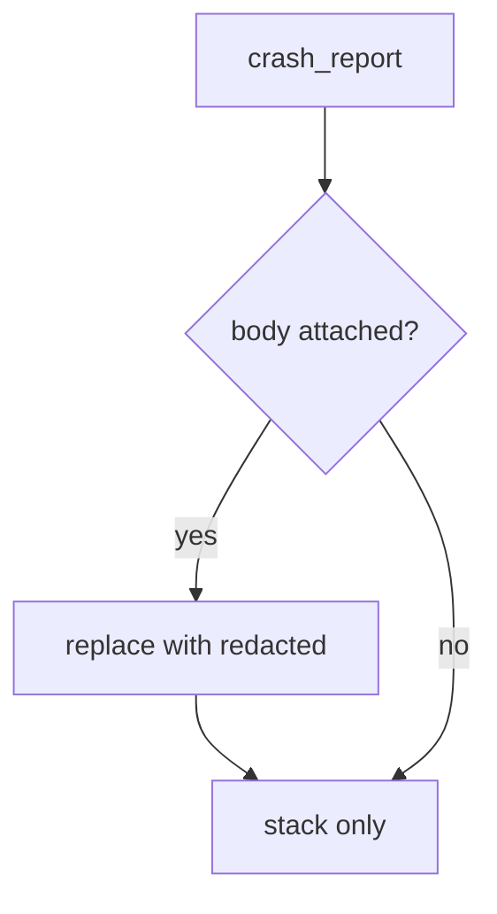

# 8.5-LO-04 — Redact before send; do not trust the SDK default

**Kind:** design-exercise
**Loop step:** 4 Build
**Standards:** OWASP ASVS 5.0.0 (final) `v5.0.0-16.2.5`. MASVS 2.1.0 `MASVS-PRIVACY-1`.

## Structural means the body never enters the report

`crash_report` must not copy `note_body` into the payload. A constant `'[redacted]'` (lab stand-in) is the teaching shape. Do not attach the live note, clipboard, or screenshot.

## Mental model: redact then send



Fail-safe: if the SDK offers “include last screen,” leave it off. Do not accept a Play Data safety form as the strip.

## Why this restores the cell

| After the fix | Must be true |
|---|---|
| `crash_report('secret')` | `'secret'` not in the report |
| stack key | still present so the crash is useful |

## What this is not

Crashlytics “automatic.” Play Data safety. A tracker-SDK “privacy mode” sticker. MASVS spreadsheet membership (9.1).

## Practice

Name the predicate. Run:

```
python3 -m pytest labs/8.5/8.5-lab/tests --impl fixed
```

Must pass.

## Transfer

Clinic: stop putting patient names in exception messages; the lab still uses synthetic strings.

## Residual risk

Vendor copies already sent (5.1 purge); screenshots; ANR; `v5.0.0-16.5.4` last-resort handlers (Level 3) that stringify arguments.
