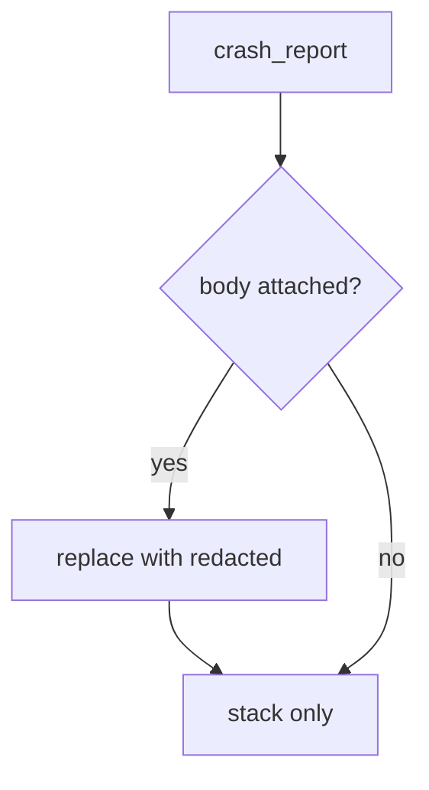

# 8.5-LO-04 — Redact before send; do not trust the SDK default

**Kind:** design-exercise
**Loop step:** 4 Build
**Standards:** OWASP ASVS 5.0.0 (final) `v5.0.0-16.2.5`. MASVS 2.1.0 (final) `MASVS-PRIVACY-1`. `v5.0.0-16.5.4` is **Level 3, advanced**. PRIVACY-3 is transparency, not the strip.

## Structural means the body never enters the report

`crash_report` must not copy `note_body` into the payload. A constant `'[redacted]'` (lab stand-in) is the teaching shape. Structural means that omit — not Crashlytics “automatic,” not a Play Data safety form, not a tracker-SDK “privacy mode” sticker.

The smallest restore for SecureCollab Android crash telemetry is: `'secret'` absent from the report. Fail-safe: if the SDK offers “include last screen,” leave it off. Do not fail open because support “needs the last chart.” Do not attach the live note, clipboard, or screenshot.

## Mental model: redact then send



The lab’s fixed tree returns `'note': '[redacted]'` and keeps a `stack` key so the crash is still useful. Production still needs the same omit for screenshots, ANR traces, and leftover `READ_LOGS`. Vendor as processor remains 5.1: redact does not make an already-sent copy disappear. Last-resort handlers (`v5.0.0-16.5.4`, Level 3 advanced) can still stringify arguments.

ASVS `v5.0.0-16.2.5` wants logging by protection level — the same rule as 3.1, now at a mobile sink. This pytest is that sentence for `crash_report("secret")`.

## Why this restores the cell

| After the fix | Must be true |
|---|---|
| `crash_report('secret')` | `'secret'` not in the report |
| stack key | still present so the crash is useful |

## What this is not

Crashlytics “automatic.” Play Data safety. A tracker-SDK “privacy mode” sticker. MASVS spreadsheet membership (9.1). HTTPS to the vendor as confidentiality. FLAG_SECURE as telemetry redaction.

## Mechanism limits

- Screenshots in “send feedback.”
- ANR traces and logcat if a leftover `READ_LOGS` path prints the body.
- Vendor as processor — contract + 5.1, not disappearance.
- Last-resort handlers (`v5.0.0-16.5.4`, Level 3) can still dump frames that embed arguments.
- Web Sentry (10.5) is another sink of the same body.

## Practice

Name the predicate (body never in the payload; stack may remain). Run:

```text
python3 -m pytest labs/8.5/8.5-lab/tests --impl fixed
```

Must pass. Run from the lab directory if collection at repo root is polluted.

## Transfer

Clinic: stop putting patient names in exception messages; the lab still uses synthetic strings.

## Residual risk

Vendor copies already sent (5.1 purge); screenshots; ANR; leftover `READ_LOGS`; Level 3 last-resort handlers; 10.5 web crash sinks.

## Non-goals

Do not call a live vendor. Do not claim Gate 8 from a Play Data safety screenshot. Do not teach MASVS L1/L2/R as current levels.
