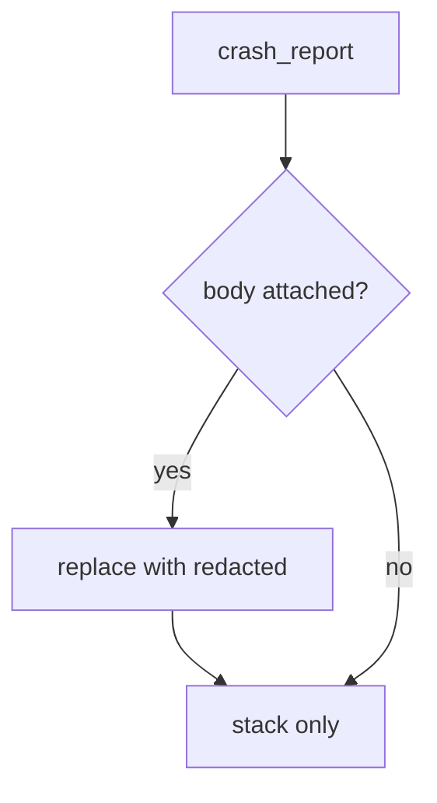

# Redact before send; do not trust the SDK default

**Kind:** design-exercise
**Loop step:** 4 Build

## The rule

A denylist of yesterday's crash fields is not the fix. Hiding a scanner warning is not the fix. “We filled in the store’s privacy form” is not the fix.

The structural change is: `crash_report` **does not copy `note_body` into the payload**. A constant `'[redacted]'` (the local stand-in) is the teaching shape. Structural means omit — not a crash product set to “automatic,” not a store form, not a tracker-SDK “privacy mode” sticker.

The smallest restore for the notes app’s crash telemetry is: `'secret'` absent from the report. Fail-safe: if the SDK offers “include last screen,” leave it off. Do not fail open because support “needs the last chart.” Do not attach the live note, the clipboard, or a screenshot.

## Picture: redact then send



The repaired files return `'note': '[redacted]'` and keep a `stack` key so the crash is still useful. Production still needs the same omit for screenshots, frozen-app traces, and leftover `READ_LOGS`. The vendor as a processor remains 5.1: redact does not make an already-sent copy disappear. Last-chance error handlers can still stringify arguments. That leftover stays.

The log lesson (3.1) already said: log by protection level. This check covers `crash_report("secret")`.

## What the repaired files must show

Do not treat `fixed/crash.py` as a production crash SDK.

| After the fix | Must be true |
|---|---|
| `crash_report('secret')` | `'secret'` not in the report |
| stack key | still present so the crash is useful |

Fail closed: if you are unsure whether a value is the note body, omit it. Uncertainty is a **no** on “this may go in the report,” not a yes because support wanted the last screen.

## What this is not

- A crash product set to “automatic.”
- The store’s privacy form.
- A tracker-SDK “privacy mode” sticker.
- A spreadsheet row that says you mapped a privacy list (9.1).
- HTTPS to the vendor as secrecy of the body.
- A screenshot-blocking flag as telemetry redaction.

## What the tool cannot do

- Screenshots in “send feedback.”
- Frozen-app traces and logcat if a leftover `READ_LOGS` path still prints the body.
- The vendor as a processor — a contract plus 5.1, not disappearance.
- Last-chance error handlers that dump frames with arguments. That is an advanced extra, not this week's check.
- Web crash reports (10.5) are another place for the same body.

## Can people still use it

In-app “send feedback” must not require attaching a screenshot of the note to continue. Offer a text field. Redact that field before send.

## Practice

Name the check (body never in the payload; stack may remain). Run:

```text
python3 -m pytest labs/8.5/8.5-lab/tests --impl fixed
```

## Use it somewhere new

A clinic example: stop putting patient names in exception messages. The lab still uses fake strings.

## What can still go wrong

Vendor copies already sent (5.1 purge). Screenshots. Frozen-app traces. Leftover `READ_LOGS`. Last-chance handlers. Web crash sinks (10.5).
