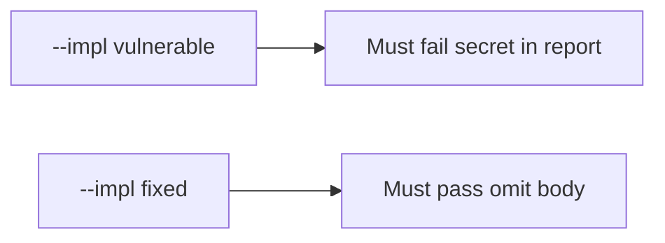

# 8.5-LO-05 — Evidence is the body absent, then a passing pair

**Kind:** verification-lab
**Loop step:** 5 Verify
**Standards:** OWASP MASVS 2.1.0 (final) `MASVS-PRIVACY-1`. ASVS 5.0.0 (final) `v5.0.0-16.2.5`.

## An invariant that cannot fail a test is still a slogan

“We filled Play Data safety” is not evidence. “Crashlytics is on HTTPS” is a mechanism observation. The oracle is: `'secret' not in str(crash_report("secret"))` and an honest crash still has a `stack` key. The secret-in-report observation must be **false** on `--impl vulnerable` (body present) and **true** on `--impl fixed`. Do not call a crash vendor.

## Mental model: vulnerable must fail: secret in report

The failing observation on `--impl vulnerable` is **secret in report**. A passing collection count is not this cell.



| Mode | Must show for this module |
|---|---|
| Negative / abuse | `'secret'` not in `str(crash_report('secret'))`; vulnerable must fail |
| Normal | honest crash still has a `stack` key (may pass on both) |
| Not claimed | real Crashlytics; Play Console; screenshot pipelines; vendor DLP |

Lab tests in `labs/8.5/8.5-lab/tests/test_property.py`. `test_crash_report_omits_note_body` is a **forbidden-outcome** test: a report that includes the body is not allowed to count as a passing control.

```text
python3 -m pytest labs/8.5/8.5-lab/tests --impl vulnerable
python3 -m pytest labs/8.5/8.5-lab/tests --impl fixed
```

Honest stack-present may pass on both implementations. That does not excuse the body-omit test. If vulnerable does not fail `test_crash_report_omits_note_body`, the lab is miswired—fix the wiring, not the assertion.

## What the tests do not prove

- Vendor DLP after send
- MASVS-PRIVACY on a physical device
- That debug logcat is empty on a rooted phone (8.1)
- Screenshot / ANR pipelines
- Last-resort handlers (`v5.0.0-16.5.4`, Level 3 advanced)
- Web Sentry (10.5)

Record those as residuals or later modules, not as silent passes.

## Practice

Execute both implementations this session from the lab directory if needed. Write the fail/pass pair next to the matrix row. Reject a “test” that only greps `Crashlytics` in Gradle without calling `crash_report("secret")`.

## Transfer

Clinic: a test that only asserts “crash dialog shown” is not this cell. A test that only asserts HTTP 200 is 9.3’s shape failure. A live Sentry call is out of scope.

## Non-goals

Do not add a live Crashlytics trophy. Do not log note bodies. Keys stay out of this file. Do not use MASVS L1/L2/R.
