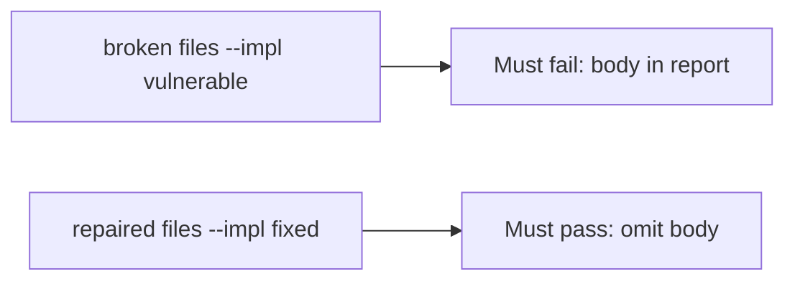

# A broken crash report must fail the check

**Kind:** verification-lab
**Loop step:** 5 Verify

## Check it

“We filled in the store’s privacy form” is not evidence. “The crash product uses HTTPS” is a tool observation. The check is: `'secret' not in str(crash_report("secret"))` and an honest crash still has a `stack` key. That body-absent observation must be **false** on the broken files and **true** on the repaired files. Do not call a crash vendor.

## Picture: a broken crash report must fail the check

A check that only counts passing tests can still look green while the body is still in the report.



If both pass, the test is not looking at the body substring.

## What the check has to show

| Mode | Must show for this topic |
|---|---|
| Normal | Honest crash still has a `stack` key (may pass on both) |
| Wrong input | `'secret'` not in `str(crash_report('secret'))`; broken files must fail |
| Abuse | Unsure values are not attached (fail closed; leftover if not in this check) |
| Not claimed | A real crash console; the public store; screenshot pipelines; vendor DLP |

The test `test_crash_report_omits_note_body` is there so a report that includes the body cannot sneak through.

Honest stack-present may pass on both implementations. That does not excuse the body-omit test. If the broken files do not fail `test_crash_report_omits_note_body`, the lab is miswired — fix the wiring, not the assertion.

```text
python3 -m pytest labs/8.5/8.5-lab/tests --impl vulnerable
python3 -m pytest labs/8.5/8.5-lab/tests --impl fixed
```

A test that only greps a crash product name in Gradle without calling `crash_report("secret")` is not this topic's evidence. This practice never opens a live crash project.

## What the tests do not prove

- Vendor DLP after send
- A privacy list on a physical device
- That debug logcat is empty on a rooted phone (8.1)
- Screenshot / frozen-app pipelines
- Last-chance error handlers (an advanced extra)
- Web crash reports (10.5)

## Practice

```text
python3 -m pytest labs/8.5/8.5-lab/tests --impl vulnerable
python3 -m pytest labs/8.5/8.5-lab/tests --impl fixed
```

Reject a “test” that only greps a crash product name without calling `crash_report("secret")`.

## Use it somewhere new

A clinic example: a test that only asserts “crash dialog shown” is not this topic. A test that only asserts HTTP 200 is the wrong observation. A live web-crash call is out of scope.

## What this page is not doing

Do not treat a live crash screenshot as proof. Do not log note bodies. Answer keys are not on this site.
