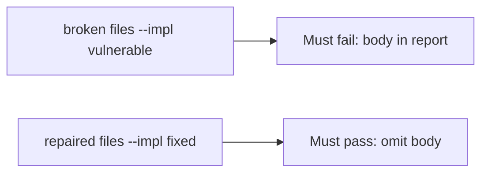

# A broken crash report must fail the check

**Kind:** verification-lab
**Loop step:** 5 Verify

## Check it

A filled-in store privacy form does not strip `secret` from the crash body. HTTPS to the crash product is a hop. `'secret'` must not appear in `str(crash_report("secret"))`, and an honest crash still has a `stack` key. On the broken helper, the body is still in the report. Repair keeps `'secret'` out of the crash payload. Do not call a crash vendor.

## Picture: a broken crash report must fail the check

The crash report can still hold the body even when tests pass.



If the broken crash report still passes, the body substring was never redacted.

## What the check has to show

| Mode | Must show for this topic |
|---|---|
| Normal | Honest crash still has a `stack` key (may pass on both) |
| Wrong input | `'secret'` not in `str(crash_report('secret'))`; broken files must fail |
| Abuse | Unsure values are not attached (leftover if not in this check) |
| Not claimed | A real crash console; the public store; screenshot pipelines; vendor DLP |

`test_crash_report_omits_note_body` watches for a report that still includes the body.

Keep a crash report that only proves the stack is present. Omit the body. If the broken files do not fail `test_crash_report_omits_note_body`, the lab is miswired — fix the wiring, not the assertion.

```text
python3 -m pytest labs/8.5/8.5-lab/tests --impl vulnerable
python3 -m pytest labs/8.5/8.5-lab/tests --impl fixed
```

A crash-product name in Gradle is not `crash_report("secret")`. This practice never opens a live crash project.

## What the tests do not prove

- Vendor DLP after send
- A privacy list on a physical device
- That debug logcat is empty on a rooted phone (8.1)
- Screenshot / frozen-app pipelines
- Last-chance error handlers (an advanced extra)
- Web crash reports (10.5)

## Practice

Call `crash_report("secret")`. A crash-product name in Gradle is inventory.

## Use it somewhere new

A shown crash dialog is not a redacted body. HTTP 200 is the hop. Do not make a live web-crash call.

## What this page is not doing

A live crash screenshot is not a redacted report body. Do not log note bodies. Answer keys are not on this site.
