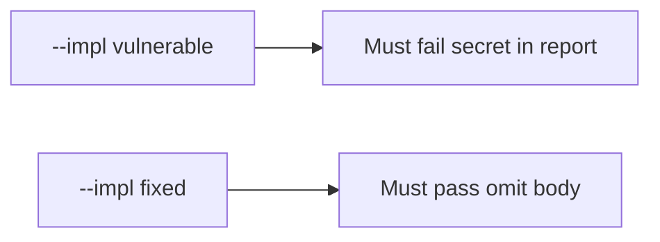

# 8.5-LO-05 — Evidence is the body absent, then a passing pair

**Kind:** verification-lab
**Loop step:** 5 Verify
**Standards:** OWASP MASVS 2.1.0 (final) `MASVS-PRIVACY-1`. ASVS `v5.0.0-16.2.5`.

## An invariant that cannot fail a test is still a slogan

“We filled Play Data safety” is not evidence. The oracle is the local pair. Do not call a crash vendor.

## Mental model: fail-on-vulnerable, pass-on-fixed



| Case | Must show |
|---|---|
| Negative / abuse | `'secret'` not in `str(crash_report('secret'))` |
| Normal | honest crash still has a `stack` key |
| Not claimed | real Crashlytics; Play Console; screenshot pipelines |

```
python3 -m pytest labs/8.5/8.5-lab/tests --impl vulnerable
python3 -m pytest labs/8.5/8.5-lab/tests --impl fixed
```

Honest stack-present may pass on both.

## What the tests do not prove

- Vendor DLP after send
- MASVS-PRIVACY on a physical device
- That debug logcat is empty on a rooted phone (8.1)

## Practice

Execute both implementations. Map each test to an LO-02 cell.

## Transfer

Clinic: a test that only asserts “crash dialog shown” is not this cell. A test that only asserts HTTP 200 is 9.3’s shape failure.
