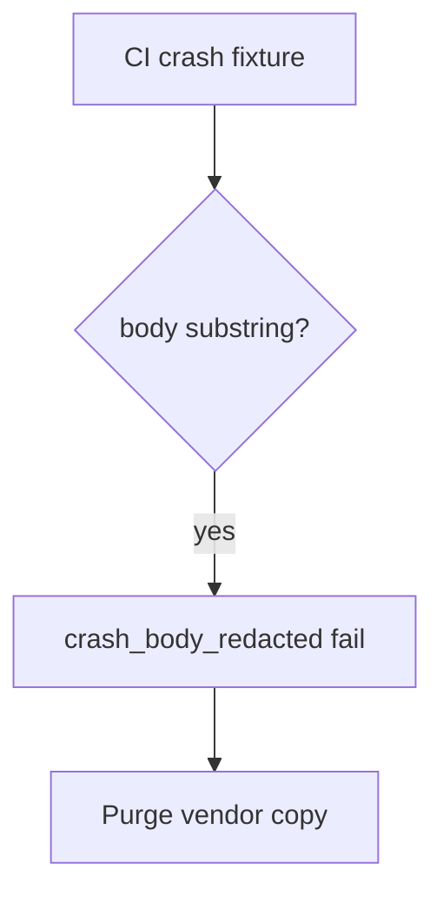

# crash_body_redacted without logging the body

**Kind:** operations-exercise
**Loop step:** 6 Operate

## Stopping it is not enough

A new SDK version can turn “include extras” back on after `crash_report` was “fixed once.” Pair notice and recover. Do not log the body you just redacted (3.1). Do not attach the report body to the ticket.

## Picture: body in telemetry is a signal

A redaction miss is a notice-and-recover problem, not a licence to quote the note in the paging channel. Notice names the crash. Recover purges the vendor copy. Neither reprints the body.



Industry lists name detect, respond, recover. They do not pick a crash product. They do not prove this report is clean. Someone still has to own the leftover.

Re-run `test_crash_report_omits_note_body` after any crash-SDK change. A green “store privacy form filled” tile is not that pytest. Tracker SDKs and web crash reports (10.5) are other places for the same body — inventory them before you claim recover.

## Signals that do not become a second leak

| Outcome | This topic |
|---|---|
| Notice | `crash_body_redacted`; a CI check of fixtures |
| What the line holds | Crash id, app version, reason; **never** the body |
| Respond | Stop the printer that reintroduced the field; do not paste the matching report into chat |
| Recover | Keep the redact; purge the vendor copy; tell people if needed |
| Leftover | The vendor as a processor; screenshots; frozen-app traces; leftover `READ_LOGS` |

A crash dashboard will show crash counts and stay silent when the last extra still holds the note. Detection must observe **`'secret'` absent**, not vendor uptime. If the alert includes the note body, you have opened the same leak as a log line (3.1) and an extra vendor copy (5.1).

A log line a reviewer can accept looks like:

```text
log_denied reason=crash_body_redacted crash_id=cr_85e app=release
```

Not: a note body, a patient name, or a live crash payload.

If your alert includes the matching report, you have copied the leak into the paging channel.

## What the framework does vs what you still have to check

The same leftover `READ_LOGS` path, tracker SDK extras, and web crash drains that bypass this fixture will also bypass a “scan our crash dashboard” detector. Name those places before you claim recover. A crash-product name is not the rule.

## Can people still use it

In-app “send feedback” must not require attaching a screenshot of the note to continue. Offer a text field. Redact that field before send. If operators see a redaction-miss badge, do not encode it as color only.

## Practice

Write one log line you would accept in review. Tie it to `labs/8.5/8.5-lab`.

```text
log_denied reason=crash_body_redacted crash_id=cr_85e app=release
```

Reject any line that includes a note body, a patient name, or a live crash payload.

## Use it somewhere new

Clinic: notice a crash that would have included a fake name; do not attach the report body to the ticket. Do not call a live vendor.

## What this page is not doing

A crash-product name is not the rule. Live vendor traces are out of scope. Answer keys stay out of lessons.
