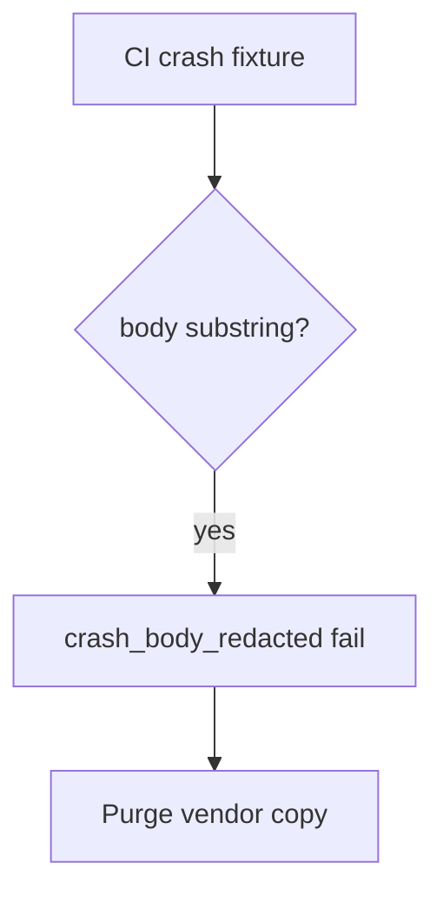

# 8.5-LO-06 — Detect crash_body_redacted without logging the body

**Kind:** operations-exercise
**Loop step:** 6 Operate
**Standards:** NIST CSF 2.0 (final) DE/RS/RC as outcome labels; ASVS 5.0.0 (final) `v5.0.0-16.2.5`. MASVS 2.1.0 (final) `MASVS-PRIVACY-4` for user control after a leak. Do not use MASVS L1/L2/R.

## Prevention is not absolute

A new SDK version can re-enable “include extras” after `crash_report` was “fixed once.” Pair detect and recover. Do not log the body you just redacted (3.1). Do not attach the report body to the ticket.

## Mental model: body in telemetry is a signal



| Outcome | This module |
|---|---|
| Detect | `crash_body_redacted`; CI grep of fixtures |
| Signal | crash id, app version, reason; never the body |
| Recover | Keep redact; purge vendor; notify if needed |
| Residual | Vendor as processor; screenshots; ANR; leftover `READ_LOGS` |

CSF 2.0 Detect / Respond / Recover name outcomes. They do not prove `v5.0.0-16.2.5`. A SIEM product name is not the property. Re-run `test_crash_report_omits_note_body` after any crash-SDK change; a green “Play Data safety filled” tile is not that pytest. Tracker SDKs and web Sentry (10.5) are other sinks of the same body — inventory them before claiming Recover.

## Framework defaults versus the operate guarantee

A Crashlytics dashboard will show crash counts and stay silent when the last extra still holds the note. Detection must observe **`'secret'` absent**, not vendor uptime. If the alert includes the note body, you have opened a 3.1 / 5.1 cell.

## Practice

Write one log line you would accept. Tie it to `labs/8.5/8.5-lab`.

```text
log_denied reason=crash_body_redacted crash_id=cr_85e app=release
```

Reject any line that includes a note body, patient name, or a live Crashlytics payload.

## Transfer

Clinic: detect a crash that would have included a synthetic name; do not attach the report body to the ticket. Do not call a live vendor.

## Usability

In-app “send feedback” must not require attaching a screenshot of the note to proceed (WCAG 2.2 Success Criterion 4.1.3). Offer a text field that is itself redacted before send.

## Non-goals

A SIEM product name is not the property. Live vendor traces are out of scope. Gates 0–10 stay not-attempted.
